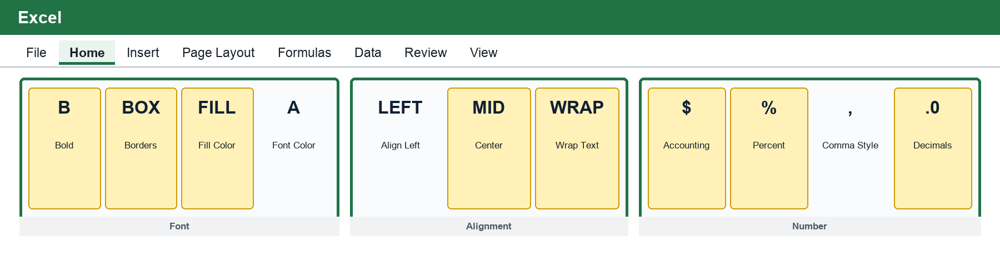
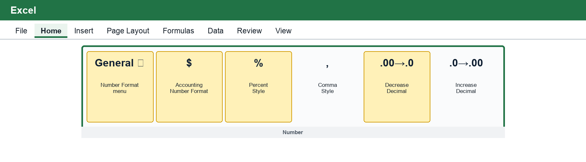
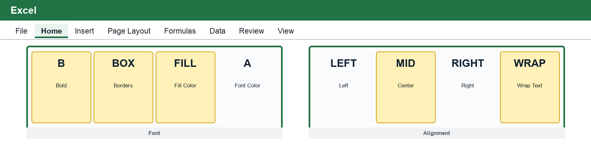
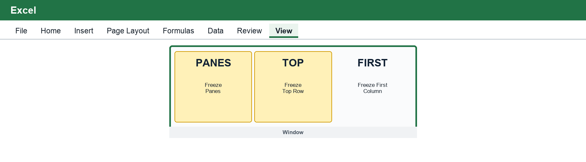

# BUS 123 - EXCEL-M02-L01 - Formatting and Organizing Worksheets

**Course:** Solving Business Problems with Technology - Fall 2026 - **Track:** EXCEL - **Module:** M02 - **Lesson:** L01
**Case Study Company:** Anchor & Oak Events

---

## 1 - Connect to Prior Knowledge

In Excel M01, you learned how to navigate a workbook, enter data, and build formulas with cell references. A correct formula is essential, but correctness alone does not make a worksheet useful. Managers also need to understand the result quickly, identify totals, distinguish inputs from formulas, and follow the structure without asking the workbook creator for an explanation.

Formatting is therefore part of business communication. A workbook with inconsistent dates, unlabeled currency, random colors, and hidden totals creates doubt even when every calculation is correct. A well-organized workbook makes the same calculations easier to audit and easier to trust.

Anchor & Oak Events tracks event dates, guest counts, revenue, catering costs, staffing costs, and net profit. In this lesson, you will turn that raw booking summary into a manager-ready worksheet.

---

## 2 - Core Concepts

### Where the Formatting Tools Are in Windows Excel

Most of the tools in this lesson are on the **Home** tab of the Windows Excel ribbon. Begin every formatting task by selecting the cell or range you want to change. Then choose the command. If you format first and select later, Excel may apply the change somewhere you did not intend.

The exact spacing of the ribbon may vary with screen size or Microsoft 365 updates. If a command is hidden, widen the Excel window or select the small drop-down arrow for its group. The command names and group names remain the best landmarks.

### Part A - Number Formats Communicate Meaning

Excel stores a value separately from the way it appears. The number `4800` can be displayed as `4800`, `$4,800`, `$4,800.00`, or another format without changing the underlying value.

Choose a number format based on the business meaning:

| Data type | Recommended display | Why it helps |
|---|---|---|
| Event date | `15-Mar-26` or another consistent date style | Readers recognize the date immediately and can sort correctly. |
| Revenue and costs | Currency or Accounting | The dollar unit is visible and decimals are consistent. |
| Guest count | Whole number | Partial guests would not make sense. |
| Percentage | Percentage | A stored decimal such as `0.15` displays as `15%`. |
| General count or ID | Number or General | No currency or percentage meaning is implied. |

> **Watch Out - Formatting Does Not Change the Value**
>
> Currency formatting does not multiply a number by dollars, and Percentage formatting does not repair an incorrect formula. Always confirm the underlying value and formula first.

#### Apply a Number Format

1. Select the cells that contain the values.
2. Select the **Home** tab.
3. Find the **Number** group.
4. Open the **Number Format** menu, which usually displays **General** before a format is applied.
5. Choose **Currency**, **Accounting**, **Percentage**, **Short Date**, or another format that matches the meaning of the data.
6. Use **Increase Decimal** or **Decrease Decimal** to control only the number of digits displayed after the decimal point.

For the Anchor & Oak worksheet, select the Revenue, Catering Cost, Staffing Cost, and Net Profit values and apply **Accounting Number Format**. If cents are not useful for the manager's decision, select **Decrease Decimal** until no decimal places are displayed. This changes the display, not the stored values.

> **Windows Shortcut**
>
> Press **Ctrl+1** to open the Format Cells dialog box. Use its **Number** tab when you need more choices, such as a specific date pattern, currency symbol, or negative-number display.

### Part B - Alignment and Visual Hierarchy

Alignment helps readers scan a table:

- Text labels are usually left-aligned.
- Numbers are usually right-aligned so place values line up.
- Column headers may be centered when that improves readability.
- A title should be visually distinct from the data table.
- A total row should be more prominent than detail rows.

Use bold type, fill color, and borders sparingly. Their purpose is to establish reading order, not to decorate every cell. A quiet header fill and a clear total-row border are more effective than many unrelated colors.

#### Format a Header and Total Row

To create a clear header row:

1. Select the cells containing the column headings.
2. On **Home**, find the **Font** group and select **Bold**.
3. Open **Fill Color** and choose one quiet, high-contrast fill.
4. Open **Font Color** only if the fill requires a lighter or darker text color for readability.
5. In the **Alignment** group, select **Center** for short headings or **Wrap Text** for headings that should remain readable without making the column extremely wide.

To emphasize a total row, select the entire row of totals, apply **Bold**, and use the **Borders** menu to add a **Top Border** or **Double Bottom Border**. Avoid adding heavy borders around every cell.

### Part C - Organize the Worksheet for Scanning

A manager should be able to answer these questions in about 30 seconds:

1. What does this worksheet measure?
2. Where are the input values?
3. Which cells contain calculated results?
4. Where is the total?
5. Are any results unusually high, low, or risky?

Useful organization choices include:

- One clear title and subtitle
- One header row with consistent labels
- Detail rows in a predictable order
- Banded rows for long tables
- A distinct total row
- No merged cells inside the data table
- Consistent formats down each column
- Freeze panes when headers would otherwise scroll off screen

### Part D - Freeze Panes and Banded Rows

Freeze Panes keeps selected rows or columns visible while the rest of the worksheet scrolls. For a long event list, freezing the header row lets the reader see labels even at row 60.

Banded rows use alternating, subtle fills to help the eye follow one record across a wide table. Banding should be quiet. If every row uses a strong color, the pattern becomes distracting instead of helpful.

#### Keep the Header Visible While Scrolling

1. Select the **View** tab.
2. Find the **Window** group.
3. Select **Freeze Panes**.
4. Choose **Freeze Top Row** when the headers are in row 1.
5. Scroll downward and confirm that the header remains visible.

If the worksheet has a title above its headers, select the cell immediately below the header row, then choose **View → Freeze Panes → Freeze Panes**. Excel freezes the rows above and the columns to the left of the selected cell.

#### Add Banded Rows with Format as Table

1. Select any cell in the data range.
2. Select **Home → Format as Table** in the **Styles** group.
3. Choose a light table style with subtle banding.
4. Confirm the full data range in the Create Table dialog box.
5. Select **My table has headers**, and then select **OK**.

Format as Table does more than add color: it converts the range to an Excel table and adds filter buttons. Use it only when those table features fit the worksheet. If the activity calls for a normal cell range, apply light alternating fills manually instead.

### Part E - Color With Purpose

Use color only when it communicates a role:

| Color role | Possible use |
|---|---|
| Header | Identifies the table structure. |
| Input | Shows where a student or analyst should type. |
| Formula/result | Distinguishes calculated cells from inputs. |
| Warning | Calls attention to an exception that needs review. |

Do not rely on color alone. Pair color with labels, number formats, borders, or text so the workbook remains understandable when printed or viewed by someone with color-vision differences.

---

## 3 - Formula and Formatting Reference

Formatting supports calculations; it does not replace them. The Anchor & Oak booking summary uses these core formulas:

| Business question | Excel syntax | Meaning |
|---|---|---|
| What is one event's net profit? | `=Revenue-Catering-Staffing` | Subtract direct event costs from revenue. |
| What is total revenue? | `=SUM(RevenueRange)` | Add all event revenue values. |
| What is total net profit? | `=SUM(NetProfitRange)` | Add all calculated event profits. |
| What is revenue per guest? | `=Revenue/Guests` | Divide event revenue by attendance. |

For the Spring Gala example:

- Revenue: $4,800
- Catering: $1,820
- Staffing: $0
- Net profit formula: `=4800-1820-0`
- Net profit: **$2,980**

For four event profits of $2,980, $1,990, $5,510, and $3,290:

- Total net profit formula: `=SUM(profit_cells)`
- Total net profit: **$13,770**

The formulas should reference worksheet cells rather than typing the numbers directly into the calculation. Cell references make the workbook update when an input changes.

---

## 4 - Five-Point Formatting Audit

Before sharing a worksheet, perform this audit:

| Check | Question to ask |
|---|---|
| 1. Labels | Are the title, headers, and units clear? |
| 2. Formats | Are dates, currency, percentages, and counts displayed consistently? |
| 3. Alignment | Do text and numbers line up in a way that supports scanning? |
| 4. Structure | Are detail rows, totals, and long-table navigation easy to follow? |
| 5. Purpose | Does every color, border, and emphasis choice communicate something useful? |

A formatting audit is not a search for the prettiest worksheet. It is a test of whether the workbook is readable, consistent, and trustworthy.

### Before-and-After Practice

Open the `Booking Summary` tab in the starter workbook. Before formatting, identify the title, header row, monetary columns, date column, detail rows, and total row. Then apply the tools from this reading:

1. Apply a consistent date format to the event-date cells.
2. Apply Accounting format with an appropriate number of decimal places to all monetary columns.
3. Format the header row with one quiet fill, bold text, and readable alignment.
4. Distinguish the total row with bold text and a clear border.
5. Use Wrap Text only where a heading is cut off.
6. Freeze the correct header row and test it by scrolling.
7. Zoom out briefly and confirm that the worksheet has a clear visual hierarchy without excessive color.

---

## 5 - Check Your Understanding

Answer each question before class.

1. Why can a worksheet be mathematically correct but still difficult to trust?
2. Which number format should be used for event revenue, and why?
3. Why should numeric columns usually be right-aligned?
4. What is the purpose of a distinct total row?
5. When is Freeze Panes useful?
6. Why should color not be the only way a workbook communicates meaning?
7. Anchor & Oak has net profits of $2,980, $1,990, $5,510, and $3,290. What Excel formula should total the four referenced cells, and what is the result?

### Answer Key - Check Your Understanding

| # | Answer |
|---|---|
| 1 | Correct calculations can still be hard to interpret when labels, formats, structure, or visual hierarchy are inconsistent. |
| 2 | Currency or Accounting, because the values represent dollars and should use a consistent display. |
| 3 | Right alignment lines up place values and makes comparisons easier. |
| 4 | It separates the summary result from detail rows and makes the worksheet easier to scan. |
| 5 | Use Freeze Panes when headers or key labels would disappear while scrolling through a long worksheet. |
| 6 | Labels and structure must also communicate the meaning so the workbook remains accessible and understandable when printed. |
| 7 | Use `=SUM(the_four_profit_cells)`; the total is **$13,770**. |

---

## 6 - Key Vocabulary

| Term | Definition |
|---|---|
| **Number Format** | The display applied to a stored value, such as Currency, Accounting, Date, or Percentage. |
| **Visual Hierarchy** | The use of size, weight, spacing, and contrast to show what readers should notice first. |
| **Alignment** | The horizontal or vertical position of content within a cell. |
| **Banded Rows** | Alternating row fills that help readers track records across a table. |
| **Freeze Panes** | An Excel feature that keeps selected rows or columns visible while scrolling. |
| **Total Row** | A visually distinct row that summarizes one or more data columns. |
| **Conditional Formatting** | Formatting that changes automatically when a cell meets a defined rule. |
| **Audit-Friendly** | Organized so another person can trace calculations, identify inputs, and understand results efficiently. |

> **Before Class**
>
> Open the Excel M02 starter workbook. Locate the `Live You Try It`, `Booking Summary`, `Formatting Audit`, `Class Challenge`, and `FormulaReferenceCard` tabs. Be ready to explain one formatting choice that would help a manager understand the workbook in 30 seconds.
