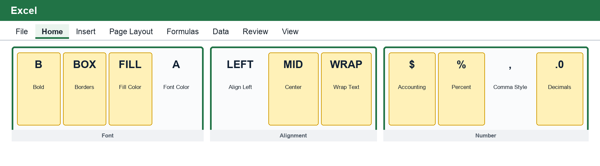
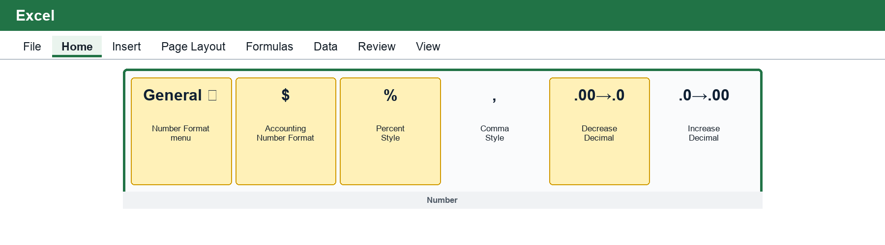
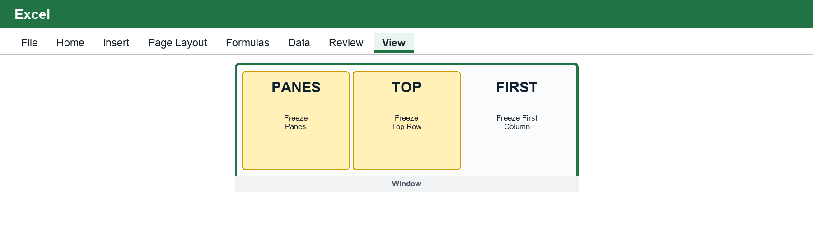

# BUS 123 - EXCEL-M02-L01 - Formatting and Organizing Worksheets

**Course:** Solving Business Problems with Technology - Fall 2026 - **Track:** EXCEL - **Module:** M02 - **Lesson:** L01
**Case Study Companies:** Tidal Goods Co. (guided practice) - Anchor & Oak Events (class challenge)

---

## 1 - Connect to Prior Knowledge

In Excel M01, you learned how to navigate a workbook, enter and edit values, and build formulas with cell references. Those skills make a worksheet calculate correctly. This lesson adds a different professional question: **Can another person understand and use the worksheet quickly?**

You will first rehearse the formatting decisions on a short Tidal Goods retail dataset. Then Anchor & Oak Events supplies event dates, guest counts, revenue, costs, net profit, and booking status for the class challenge. Its raw export can contain accurate data while still being difficult to scan. In class, you will preserve that source data, copy it into a separate working area, and build the manager-ready view yourself.

> **The Lesson Goal**
>
> Formatting is business communication, not decoration. Every format should help a reader identify meaning, compare values, find important results, or use the worksheet without breaking it.

---

## 2 - Read the Worksheet Like a Manager

Before changing colors or fonts, identify what the reader needs to know. A manager should be able to answer these questions in about 30 seconds:

1. What does this worksheet measure?
2. Which rows contain the detailed records?
3. Which columns contain dates, counts, money, or categories?
4. Where are the important summary results?
5. Is there an unusual result that needs attention?

A useful worksheet creates a visible reading path:

**Title and purpose → summary results → table headers → detail rows → exceptions**

This reading path is called **visual hierarchy**. Size, spacing, alignment, fills, borders, and number formats tell the reader where to look first and what each value means.

### Compare Two Handoffs

Imagine receiving two worksheets with the same event records:

| Raw handoff | Manager-ready handoff |
|---|---|
| Dates appear as unexplained numbers or mixed styles. | Every date uses one readable date format. |
| Revenue and costs look like general numbers. | Money columns use a consistent Currency or Accounting format. |
| Long headings and event names are clipped. | Column widths and wrapping keep labels readable. |
| Headers disappear while scrolling. | The actual table header remains visible with Freeze Panes. |
| Color is random or decorative. | Color has a stated purpose, such as identifying an exception. |

The values have not changed. The second worksheet is easier to interpret, audit, and trust.

---

## 3 - Number Formats Communicate Meaning

Excel stores a value separately from the way it appears. The stored value `4800` can display as `4800`, `$4,800`, or `$4,800.00` without changing the underlying number.

Choose the display that matches the business meaning:

| Data type | Useful display | Why it helps |
|---|---|---|
| Event date | `15-Mar-26` or another consistent date style | Readers recognize the date and can sort it correctly. |
| Revenue and costs | Currency or Accounting | The dollar unit is visible and decimals are consistent. |
| Guest count | Whole number | Partial guests would not make sense. |
| Percentage | Percentage | A stored decimal such as `0.15` displays as `15%`. |
| Event ID or category | General or Text | Excel should not imply a financial or percentage meaning. |

> **Watch Out - Formatting Does Not Repair Data**
>
> Currency formatting does not turn text into a number. Percentage formatting does not repair an incorrect value or formula. Confirm the stored value first, then choose its display.

### Where to Find the Tools in Windows Excel

Most tools in this lesson are on the **Home** tab. Select the intended cells first, then choose the command.

In the **Number** group, the Number Format menu changes how values display. **Increase Decimal** and **Decrease Decimal** change only the visible precision.

Press **Ctrl+1** to open the Format Cells dialog box when you need a specific date pattern, currency symbol, negative-number display, or alignment setting.

---

## 4 - Organize the Table for Scanning

Formatting should help the table continue working when someone scrolls, sorts, filters, or adds records.

### Create the Working Copy Before You Format

The `Raw Export` tab is the source record. The `Manager View` data area begins blank by design so you can practice creating a safe working copy.

When your instructor directs you:

1. Leave `Raw Export` unchanged.
2. Select `Raw Export!A1:J25` and copy all 10 headers plus the 24 detail records.
3. Click `Manager View!A7`.
4. Use **Paste Values** so the new view contains the source values without a live link back to the raw tab.
5. Replace the 10 `snake_case` headers with readable business labels. Do not change the 24 detail records.
6. Build the table, number formats, widths, alignment, Freeze Panes, summaries, and conditional formatting on `Manager View`.

This separates source preservation from analysis. If a working-view format or formula needs correction, the original export remains available for comparison.

### Headers and Alignment

- Keep one clear header row inside the data table.
- Left-align text labels when that supports scanning.
- Right-align numbers so place values line up.
- Use **Wrap Text** when a heading is meaningful but slightly long.
- Avoid merged cells inside the table because they interfere with sorting, filtering, and copying.

### Excel Tables and Banded Rows

**Format as Table** can add a consistent table style, banded rows, and filter buttons. The full range must include every header and every record. Subtle banding helps the eye follow one record across a wide table; strong decoration competes with the data.

### Freeze the Actual Header

Freeze Panes keeps selected rows visible while the worksheet scrolls. If a title and summary appear above the table, **Freeze Top Row is not enough**. Select the cell immediately below the actual table header and use **View → Freeze Panes → Freeze Panes**.

In the M02 Manager View, the table header is on row 7. Selecting `A8` before freezing keeps rows 1–7 visible, including the summary area and the real table headers.

---

## 5 - Use Emphasis for a Business Reason

Color and borders should communicate a role:

| Role | Possible use |
|---|---|
| Header | Identifies the table structure. |
| Summary | Separates high-level results from detail rows. |
| Input or action area | Shows where a user should make a change. |
| Warning or exception | Calls attention to a result that needs review. |

Do not rely on color alone. Pair it with a label, number format, border, or explanatory text so the workbook remains understandable when printed or viewed by someone with color-vision differences.

**Conditional Formatting** can respond to the data. Before applying a rule, complete this sentence:

> Highlight __________ because the manager needs to __________.

For example, a manager might want to identify unusually low Net Profit values for review. The threshold and color are less important than the business reason and the correct range.

---

## 6 - Formula and Formatting Reference

After you create the working copy, the Manager View includes four summary cells. In class, you will decide which range answers each business question and build formulas with worksheet or table references.

| Business question | Excel pattern | Reminder |
|---|---|---|
| What is the total of a numeric column? | `=SUM(range)` | Reference the detail rows; do not type the final total. |
| What is the average event revenue? | `=AVERAGE(range)` | Include event records only. |
| How should dates display? | `dd-mmm-yy` | A format changes display, not the stored date. |
| How should business money display? | `$#,##0` or another consistent currency format | Choose a decimal policy that fits the decision. |

Use the workbook's `FormulaReferenceCard` during class as a syntax reminder. It does not supply the finished Manager View formulas.

---

## 7 - Five-Point Formatting Audit

Before sharing a worksheet, ask:

| Check | Question |
|---|---|
| 1. Labels | Are the title, headers, and units clear? |
| 2. Formats | Do dates, money, percentages, and counts display consistently? |
| 3. Alignment | Can the reader scan labels and compare numbers quickly? |
| 4. Structure | Do the table, summaries, filters, and frozen headers continue to work? |
| 5. Purpose | Does every color, border, and emphasis choice communicate something useful? |

A formatting audit is not a search for the prettiest worksheet. It tests whether the workbook is readable, consistent, usable, and trustworthy.

---

## 8 - Check Your Understanding

Answer these five questions before class. Bring your reasoning; you will compare responses during the opening discussion.

1. Why can a mathematically correct worksheet still be difficult to trust?
2. Which display formats fit event dates, guest counts, and event revenue? Explain one choice.
3. Why can merged cells create problems inside a data table?
4. If the table header is on row 7, where should you click before choosing Freeze Panes?
5. Write one conditional-formatting purpose statement using this pattern: “Highlight ___ because the manager needs to ___.”

---

## 9 - Key Vocabulary

| Term | Definition |
|---|---|
| **Number Format** | The display applied to a stored value, such as Currency, Accounting, Date, or Percentage. |
| **Visual Hierarchy** | Size, weight, spacing, alignment, and contrast used to guide reading order. |
| **Excel Table** | A structured data range with headers, filtering, and expandable records. |
| **Banded Rows** | Alternating subtle fills that help readers track a record across a table. |
| **Freeze Panes** | A feature that keeps selected rows or columns visible while scrolling. |
| **Conditional Formatting** | Formatting that changes when a cell meets a defined rule. |
| **Audit-Friendly** | Organized so another person can trace, understand, and use the worksheet efficiently. |

> **Before Class - Open, Observe, Do Not Build Yet**
>
> Open the Excel M02 starter workbook. Read `START HERE`, then locate `Live You Try It`, `Raw Export`, `Manager View`, `Class Challenge`, and `FormulaReferenceCard`. Notice that the Tidal Goods practice data is different from the Anchor & Oak challenge data and that `Manager View!A7:J31` is blank by design. Do not edit `Raw Export`, paste data, or begin the Manager View makeover before class. Be ready to explain why the raw source must remain unchanged and name the first two actions that create the working copy.
