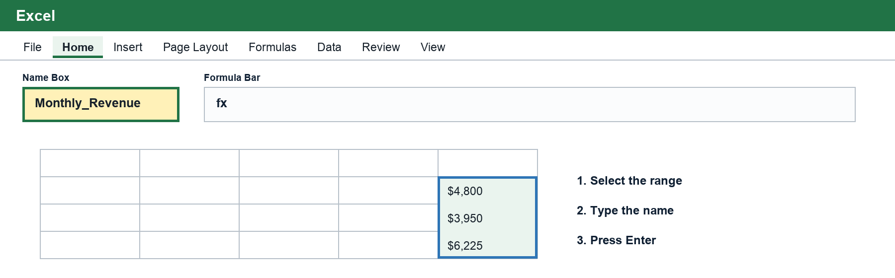
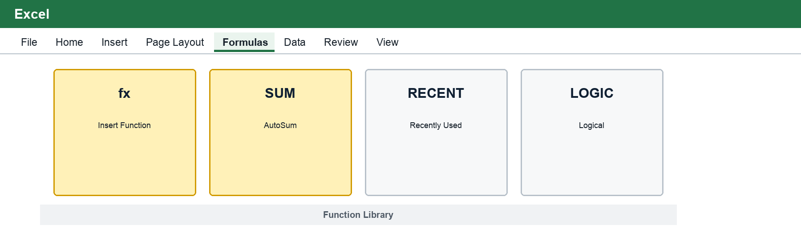
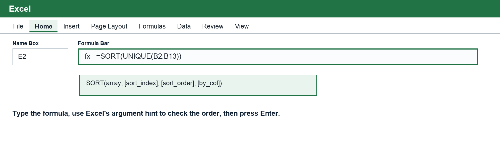
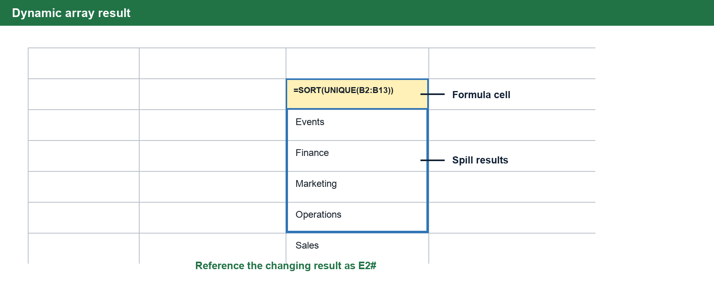
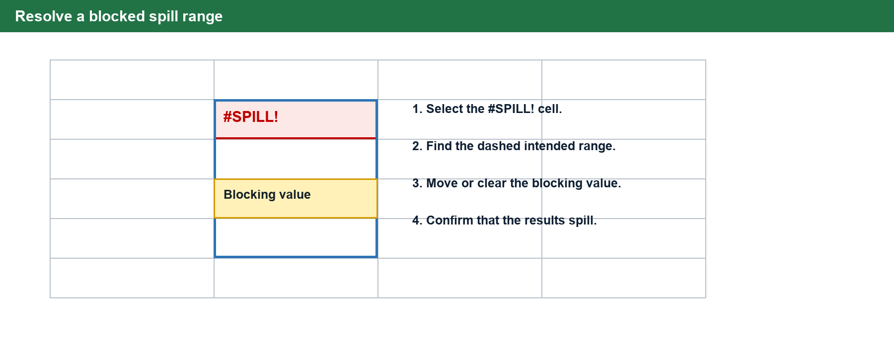

# Excel Functions for Business Analysis

| Field | Details |
| --- | --- |
| Course | BUS123 - Solving Business Problems with Technology |
| Track | Excel |
| Module | M03 |
| Lesson | L01 |

This lesson is about using Excel functions to turn messy business data into useful answers. You do not need to memorize hundreds of functions. The goal is to understand the patterns behind the functions that handle most everyday business analysis work.

By the end of this reading, you should be able to explain what a function does, recognize when a formula should spill into multiple cells, and choose a useful function based on the business question.

## 1. From Basic Formulas to Functions

Excel formulas always begin with an equals sign. A basic formula can use arithmetic operators:

| Operator | Meaning | Example |
| --- | --- | --- |
| `+` | Add | `=B2+C2` |
| `-` | Subtract | `=B2-C2` |
| `*` | Multiply | `=B2*C2` |
| `/` | Divide | `=B2/C2` |
| `^` | Exponent | `=B2^2` |

For example, Tidal Goods Co. can calculate product revenue with:

`=Units_Sold*Unit_Price`

Functions are named formulas that perform a specific task. Instead of writing a long manual formula like:

`=B2+B3+B4+B5+B6+B7+B8+B9+B10+B11+B12+B13`

you can use:

`=SUM(B2:B13)`

The function version is shorter, easier to read, and safer when rows are inserted inside the range.

> **Key Idea**
> A function is not magic. It is a named formula that takes one or more inputs, called arguments, and returns an answer.

### Named Ranges: Readable Cell References

A **named range** assigns a meaningful label to a cell or range. Instead of asking a reader to remember what `F7:F18` contains, a formula can use a name such as `Monthly_Revenue`.

| Cell-reference formula | Named-range formula | Business meaning |
| --- | --- | --- |
| `=SUM(F7:F18)` | `=SUM(Monthly_Revenue)` | Total monthly revenue values. |
| `=AVERAGE(G7:G18)` | `=AVERAGE(Net_Profit)` | Average net profit. |
| `=SUMIFS(F7:F18,C7:C18,J3)` | `=SUMIFS(Sales,Region,J3)` | Total sales for the region selected in J3. |

Named ranges make formulas easier to read and reuse, but the name must point to the correct cells. A clear name does not repair an incorrect range.

### Create a Named Range with the Name Box

1. Select the cell or range you want to name. Do not include a header unless the header is intentionally part of the range.
2. Find the **Name Box** to the left of the formula bar. It normally displays the active cell address, such as `F7`.
3. Select inside the Name Box, type a meaningful name such as `Monthly_Revenue`, and press **Enter**.
4. Open the Name Box drop-down and choose the new name. Confirm that Excel selects the intended cells.
5. Use the name in a formula, such as `=SUM(Monthly_Revenue)`, and press **Enter**.

Names cannot contain spaces. Begin with a letter, underscore, or backslash, and use underscores between words. Avoid names that look like cell addresses, such as `Q1` or `A10`.

> **Good Naming Pattern**
>
> Prefer descriptive names such as `Sales`, `Region`, `Hourly_Rate`, or `Tax_Rate`. Avoid vague names such as `Data1`, `Numbers`, or `Stuff`.

### Create or Edit a Name with Name Manager

1. Select **Formulas → Name Manager** in the **Defined Names** group.
2. Select **New** to create a name, or select an existing name and choose **Edit**.
3. Enter the name and confirm the **Refers to** range.
4. Keep the scope set to **Workbook** unless the name should work on only one worksheet.
5. Select **OK**, then **Close**.
6. Test the name by selecting it from the Name Box or pressing **F3** while editing a formula to open the Paste Name list.

Use Name Manager when a range grows, moves, or produces `#REF!`. The **Refers to** field should point to the current worksheet and intended cells, for example `=BookingSummary!$F$7:$F$18`.

### Named-Range Example: Reusable Analysis

Suppose Tidal Goods stores sales amounts in `F7:F18` and regions in `C7:C18`.

1. Select `F7:F18` and name it `Sales`.
2. Select `C7:C18` and name it `Region`.
3. Type a region, such as `North`, in `J3`.
4. In the report cell, enter `=SUMIFS(Sales,Region,J3)`.
5. Change `J3` to another region and confirm that the result updates.

This formula reads like the business question: add **Sales** where **Region** matches the value in `J3`.

## 2. The Core Summary Functions

Many business questions begin with summary functions.

| Function | Syntax | Business Question |
| --- | --- | --- |
| `SUM` | `=SUM(range)` | What is the total? |
| `AVERAGE` | `=AVERAGE(range)` | What is typical? |
| `MAX` | `=MAX(range)` | What is the highest value? |
| `MIN` | `=MIN(range)` | What is the lowest value? |
| `COUNT` | `=COUNT(range)` | How many cells contain numbers? |
| `COUNTA` | `=COUNTA(range)` | How many cells contain anything? |

Anchor & Oak Events might use these functions to summarize monthly event revenue. `SUM` answers total annual revenue. `AVERAGE` gives a typical month. `MAX` and `MIN` identify the strongest and weakest months. `COUNT` and `COUNTA` help check whether the data is complete.

> **Common Mistake**
> Do not start a numeric range on a header row. `=COUNT(F6:F18)` may look close, but if row 6 is a header, the formula is asking Excel to count the wrong range. Start on the first data row: `=COUNT(F7:F18)`.

### Enter a Summary Function in Windows Excel

You can type a function directly, use **AutoSum**, or use **Insert Function**. Typing is usually fastest once you recognize the pattern; the ribbon tools are useful while learning.

1. Select the empty cell where the answer should appear.
2. Select the **Formulas** tab.
3. In the **Function Library** group, select **AutoSum** for `SUM`, `AVERAGE`, `COUNT`, `MAX`, or `MIN`. Select the AutoSum drop-down arrow to see choices other than Sum.
4. Check the highlighted range. Drag across the correct cells if Excel selected a header, total, or incomplete range.
5. Press **Enter** to accept the formula.
6. Select the result cell and read the formula bar to verify the function and range.

For a function that is not on the AutoSum menu, select **Formulas → Insert Function**, search for the function name, select it, and complete its argument boxes. Do not accept the result until the formula answers the intended business question.

## 3. The Great Shift: Dynamic Arrays and Spilling

Older Excel often followed a "one formula, one cell" mindset. If you needed a formula to fill ten rows, you wrote it once and dragged it down.

Modern Excel can work differently. A dynamic array formula can return many values from one formula. The results automatically fill nearby empty cells. This is called **spilling**.

| Feature | Traditional Calculation | Modern Dynamic Arrays |
| --- | --- | --- |
| Output | One formula returns one result. | One formula can return many results. |
| Manual work | Often requires dragging or copying. | Results spill automatically. |
| Range behavior | Static ranges can miss new data. | Spilled results can grow or shrink. |
| Error risk | Copying errors are common. | One formula controls the full output. |

Spilling matters because it makes workbooks faster, cleaner, and easier to maintain. If a source table changes, a dynamic array result can update automatically instead of forcing the user to re-copy formulas.

### Enter a Function Using the Formula Bar

1. Select the first cell where the result should begin.
2. Type `=` followed by the function name and an opening parenthesis, such as `=UNIQUE(`.
3. Select the source range with the mouse or type the range reference.
4. Read Excel's argument hint below the formula bar. The bold argument is the one Excel expects next.
5. Type commas between arguments and place text criteria inside quotation marks.
6. Close every parenthesis and press **Enter**. Do not press **Ctrl+Shift+Enter** for modern dynamic arrays.

## 4. The Spill Range and the Hash Sign

When a dynamic array formula spills, the first cell is the formula cell. The cells around it are spill results.

If the formula starts in `E2`, the whole spilled range can be referenced as:

`=E2#`

The hash sign tells Excel to use the entire spilled result, even if it grows or shrinks later.

| Reference Type | Meaning |
| --- | --- |
| `$A$1:$A$10` | A fixed range. It does not automatically follow a spill. |
| `E2` | Only the first cell of the spill. |
| `E2#` | The full spilled range that starts in E2. |

This is one of the most important ideas in modern Excel. A formula can create a live list, and another formula can refer to the full list with `#`.

Only the top-left cell contains the formula. Select another cell in the spill range and Excel outlines the full result. To change the formula, return to the top-left formula cell rather than typing over an individual spill result.

> **Why It Matters**
> If a `UNIQUE` list grows from five departments to seven departments, `E2#` grows with it. A downstream formula or drop-down list can stay synced without manual editing.

## 5. UNIQUE, SORT, and FILTER

Three dynamic array functions do a lot of everyday data organization work.

| Function | Core Purpose | Typical Spill Direction |
| --- | --- | --- |
| `UNIQUE` | Extracts distinct values from a list. | Down rows or across columns. |
| `SORT` | Reorders data alphabetically or numerically. | Same shape as the source. |
| `FILTER` | Extracts records that meet criteria. | Across columns and down rows. |

`UNIQUE` is useful for cleaning repeated categories. `SORT` makes the result organized. Together, they can replace a lot of manual sorting and duplicate removal.

`=SORT(UNIQUE(Department_Column))`

`FILTER` extracts rows that meet a condition. Harborside Medical Center could use it to pull patient billing records above a threshold:

`=FILTER(A2:F200,F2:F200>500,"No matches")`

The key is the include argument. Excel evaluates each row as TRUE or FALSE. Rows that evaluate to TRUE spill into the result.

### Build a Dynamic List Safely

1. Choose a blank area outside the source table with enough empty cells below and to the right.
2. Select the top-left destination cell.
3. Type the formula, such as `=SORT(UNIQUE(B2:B13))`.
4. Press **Enter** once and allow Excel to spill the result.
5. Add or change a source value and confirm that the list updates.
6. Reference the complete result with the top-left cell followed by `#`, such as `=E2#`.

## 6. Logic: IF, AND, and OR

Functions can also make decisions. The `IF` function checks a condition and returns one result if the condition is true and another if the condition is false.

`=IF(logical_test,value_if_true,value_if_false)`

Meridian Advisory Group might flag payroll records like this:

`=IF([@[Hours Worked]]>40,"Overtime","Regular")`

Sometimes one condition is not enough.

| Function | Use When | Example Pattern |
| --- | --- | --- |
| `AND` | Every condition must be true. | `=AND([@Department]="Nursing",[@Hours]>40)` |
| `OR` | At least one condition must be true. | `=OR([@Priority]="High",[@Priority]="Critical")` |

A common beginner mistake is writing:

`=OR([@Priority]="Critical","High")`

Excel cannot guess that "High" should also be compared to `[@Priority]`. You must repeat the full condition:

`=OR([@Priority]="Critical",[@Priority]="High")`

### Build an IF Formula One Argument at a Time

1. Select the result cell and type `=IF(`.
2. Enter the logical test, such as `D2>40`.
3. Type a comma, then enter the true result in quotation marks: `"Overtime"`.
4. Type another comma, then enter the false result: `"Regular"`.
5. Close the parenthesis and press **Enter**.
6. Test at least one record that should return each outcome.

The completed formula is `=IF(D2>40,"Overtime","Regular")`. If you nest `AND` or `OR` inside `IF`, finish the inner function's closing parenthesis before entering the true and false results.

## 7. Conditional Reporting with SUMIFS and COUNTIFS

Business reporting often asks questions with conditions:

- What is total revenue for one region?
- How many records are late?
- What is the total for one department and one status?

The plural `IFS` functions are usually the best default because they can handle one condition or many.

| Function | Use It To | Example |
| --- | --- | --- |
| `SUMIFS` | Add values that meet one or more criteria. | `=SUMIFS(Sales,Region,"North",Category,"Kitchen")` |
| `COUNTIFS` | Count rows that meet one or more criteria. | `=COUNTIFS(Status,"Late",Department,"Nursing")` |
| `AVERAGEIFS` | Average values that meet one or more criteria. | `=AVERAGEIFS(Sales,Region,"North")` |

Tidal Goods Co. might use `SUMIFS` to total sales for a category and region. Harborside Medical Center might use `COUNTIFS` to count late timesheets by department.

> **Better Practice**
> Link criteria to input cells when possible. A report that uses `=SUMIFS(Sales,Region,C9)` is easier to update than a formula that hard-codes `"North"` in every cell.

### Build SUMIFS in the Correct Order

1. Select the answer cell and type `=SUMIFS(`.
2. Select the numeric **sum range** first.
3. Type a comma and select the first **criteria range**.
4. Type a comma and select or type its criterion.
5. Repeat the criteria-range and criterion pair for each additional condition.
6. Close the parenthesis and press **Enter**.
7. Confirm that every range has the same number of rows and begins on the same data row.

For example, `=SUMIFS(Sales,Region,C9,Category,D9)` adds Sales only where both criteria match the input cells. Selecting criteria cells instead of typing words into the formula makes the report easier to reuse.

## 8. XLOOKUP: The Modern Connector

`XLOOKUP` connects tables. It finds a lookup value in one range and returns a matching value from another range.

`=XLOOKUP(lookup_value,lookup_array,return_array,if_not_found)`

Meridian Advisory Group might use `XLOOKUP` to find an hourly rate based on an employee ID:

`=XLOOKUP(A2,EmployeeTable[Employee ID],EmployeeTable[Hourly Rate],"Check ID")`

Compared with older lookup functions, XLOOKUP is more flexible. It can look left or right, can return more than one column, and includes a built-in not-found message.

### Build XLOOKUP from the Business Question

1. Identify the value you already have, such as an employee ID. This is the **lookup value**.
2. Select the column where Excel should search. This is the **lookup array**.
3. Select the column containing the answer you want. This is the **return array**.
4. Add a useful not-found message such as `"Check ID"`.
5. Press **Enter**, then test one valid ID and one missing ID.

The lookup and return arrays must cover corresponding rows. XLOOKUP uses an exact match by default, so beginners normally should not add a match-mode argument.

## 9. Date and Schedule Helpers

Excel dates are numbers behind the scenes, which means functions can calculate schedules.

| Function | Purpose | Example |
| --- | --- | --- |
| `EOMONTH` | Returns the last day of a month. | `=EOMONTH(A2,0)` |
| `WORKDAY.INTL` | Returns a workday while skipping custom weekends or holidays. | `=WORKDAY.INTL(A2,10,"0000011")` |
| `SEQUENCE` | Generates a list of numbers. | `=SEQUENCE(12)` |

`SEQUENCE` becomes especially useful when paired with date functions. A monthly report can generate month numbers or month-end dates without typing each row manually.

`=EOMONTH(Start_Date,SEQUENCE(12)-1)`

## 10. Troubleshooting Function Errors

Most Excel errors are clues. Read the clue before changing the formula.

| Error | Likely Meaning |
| --- | --- |
| `#######` | The column is too narrow to display the value. |
| `#NAME?` | Excel does not recognize text in the formula, often because of a typo. |
| `#VALUE!` | One or more arguments are the wrong type. |
| `#DIV/0!` | The formula is dividing by zero or a blank denominator. |
| `#REF!` | The formula refers to a deleted or invalid cell. |
| `#SPILL!` | The spill range is blocked or cannot expand. |

When a formula does not work, ask these questions:

1. Does the formula start with `=`?
2. Are all parentheses closed?
3. Are text criteria inside quotation marks?
4. Does the range start on the first data row?
5. Does the formula need an absolute reference?
6. Is the spill range empty?
7. Does the answer match the business question?

### Correct a #SPILL! Error

1. Select the cell displaying `#SPILL!`.
2. Look for Excel's dashed outline showing the intended spill range.
3. Select the warning icon if available and choose **Select Obstructing Cells**.
4. Move or clear the blocking content. Also check for merged cells or a spill formula placed inside an Excel table.
5. Confirm that Excel fills the complete spill range after the obstruction is removed.

Do not delete the dynamic-array formula simply because the output area is blocked. Fix the obstruction first. If the formula is inside an Excel table, move it to a normal worksheet range because spilled array formulas cannot spill inside tables.

## 11. The 80/20 Function Toolkit

Excel has hundreds of functions, but a small toolkit handles most early business analysis work:

| Toolkit Area | Functions |
| --- | --- |
| Basic summaries | `SUM`, `AVERAGE`, `MAX`, `MIN`, `COUNT`, `COUNTA` |
| Logic | `IF`, `AND`, `OR` |
| Conditional reporting | `SUMIFS`, `COUNTIFS`, `AVERAGEIFS` |
| Lookup | `XLOOKUP` |
| Dynamic arrays | `FILTER`, `SORT`, `UNIQUE`, `SEQUENCE` |
| Text cleanup | `TEXTJOIN` |
| Dates | `EOMONTH`, `WORKDAY.INTL` |
| Multi-row math | `SUMPRODUCT` |

This lesson skips custom function building with `LAMBDA`. That is a powerful advanced tool, but it is not the first priority for BUS123. The first priority is choosing the right built-in function for the business question.

## Check Your Understanding

Answer these before class.

1. What is the main difference between a traditional formula copied down a column and a dynamic array formula?
2. What does the `#` symbol do when placed after the first cell of a spilled result?
3. Which function would return a clean list of unique department names?
4. Which function would extract all rows where a balance is greater than `$500`?
5. Why is `=OR([@Priority]="Critical","High")` incorrect?
6. When would you use `SUMIFS` instead of `SUM`?
7. What does `#SPILL!` usually mean?
8. Why is `XLOOKUP` generally better than older lookup tools for new Excel work?
9. What is one advantage of `=SUM(Monthly_Revenue)` over `=SUM(F7:F18)`?
10. Where would you check which cells a named range currently refers to?

## Key Vocabulary

| Term | Meaning |
| --- | --- |
| Function | A named formula that performs a specific task. |
| Argument | An input a function needs inside its parentheses. |
| Dynamic Array | A formula result that can return multiple values. |
| Spill | The behavior where dynamic array results fill neighboring cells. |
| Spill Range | The full output range created by a dynamic array formula. |
| Hash Reference | A reference like `E2#` that points to the full spill range. |
| Criteria | A rule or condition used by a function. |
| Structured Reference | A table-based reference that uses column names instead of cell coordinates. |
| Named Range | A meaningful name assigned to a cell or range, such as `Monthly_Revenue`. |
| Name Manager | The Formulas-tab tool used to create, edit, delete, and verify named ranges. |
