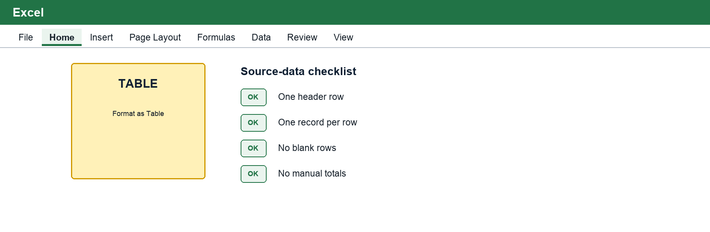
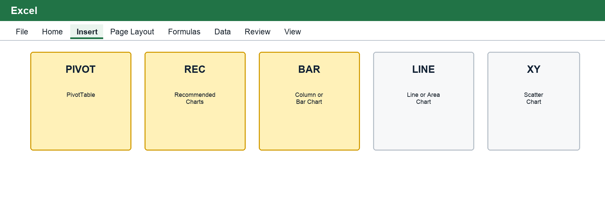
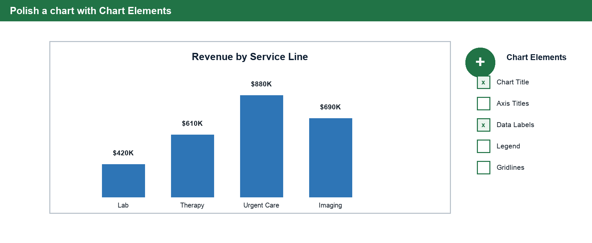
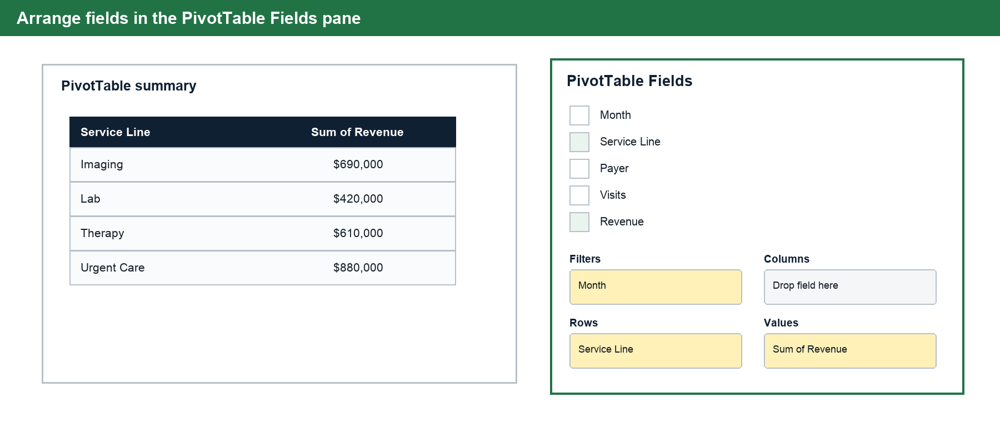
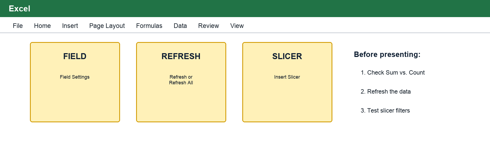

# Excel Charts and PivotTables

| Field | Details |
| --- | --- |
| Course | BUS123 - Solving Business Problems with Technology |
| Track | Excel |
| Module | M04 |
| Lesson | L01 |
| Case | Harborside Medical Center |

This lesson is about turning rows of business data into visuals and summaries that help people make decisions. In Module 3, you practiced formulas and functions that calculate accurate numbers. In Module 4, those accurate numbers become charts and PivotTables that a manager can scan, question, and trust.

Harborside Medical Center will be our case. The hospital has monthly data about service lines, payer categories, visits, and revenue. A spreadsheet can store all of those records, but leaders do not want to read every row one at a time. They want to know which service line is strongest, whether visit volume is changing, and which payer mix needs attention.

By the end of this reading, you should be able to choose a chart based on the business question, identify the habits that make charts trustworthy, and explain how a PivotTable summarizes a clean table.

## 1. Start With the Business Question

A chart is not decoration. A chart is an answer in visual form. Before you click Insert, pause and name the question you are trying to answer.

| Business question | Better chart choice | Why it fits |
| --- | --- | --- |
| Which service line produced the most revenue? | Column or bar chart | Compares categories by height or length. |
| Are visits rising or falling across months? | Line chart | Shows change over time. |
| What share of revenue came from each payer? | Pie or donut chart | Shows parts of a whole when there are only a few pieces. |
| Does higher visit volume connect with higher revenue? | Scatter chart | Compares two numeric variables. |

The mistake beginners make is choosing the chart they like, not the chart that fits the logic of the question. A line chart implies order and movement over time. A pie chart implies parts of one whole. A column chart implies comparison across categories. A scatter chart implies a relationship between two numeric measurements.

> **Key Idea**
> The business question chooses the chart type. Design choices come after that.

## 2. Clean Tables Come Before Good Charts

Charts and PivotTables are only as trustworthy as the source table behind them. If Excel cannot understand the table boundaries, fields, or record structure, the output may look polished while still being wrong.

A clean Excel table has:

- One header row with clear field names.
- One record per row.
- One kind of data in each column.
- No blank rows inside the data range.
- No manual total row mixed into the source table.
- Consistent categories, spelling, dates, and number formats.

For Harborside, a clean table might have columns such as Month, Service Line, Payer, Visits, Revenue, and Average Revenue per Visit. Each row should represent one service-line record for one month and payer. A row that says "Total" belongs in a summary area, not inside the raw source table.

### Convert the Source Range to an Excel Table

1. Select any cell inside the source data.
2. Select **Home → Format as Table** and choose a simple, readable style.
3. In the Create Table dialog box, confirm that the range includes every record and field but excludes notes or summary calculations.
4. Select **My table has headers**, then select **OK**.
5. Select the new table and open **Table Design**. Give the table a meaningful name such as `HarborsideData`.
6. Use each field's filter arrow to check for blanks, inconsistent spellings, or accidental totals.

Using an Excel table helps charts and PivotTables recognize the full source range. When new records are added directly below the table, the table can expand to include them.

## 3. Chart Selection Is a Logic Choice

Different chart types encode information in different ways.

| Chart type | Use it when | Watch out for |
| --- | --- | --- |
| Column chart | You are comparing a small set of categories. | Long labels may be easier to read in a bar chart. |
| Bar chart | You are comparing categories with longer text labels. | Sort the bars when ranking matters. |
| Line chart | The x-axis is ordered time, such as months or quarters. | Do not use it for unrelated categories. |
| Pie or donut chart | You have two to four pieces of one total. | Too many slices become unreadable fast. |
| Scatter chart | Both axes are numeric measurements. | Do not use a line chart when numeric x-values are unevenly spaced. |

One common trap is the overloaded pie chart. If a chart has eight or nine slices, the reader has to compare tiny angles and colors. A sorted column chart is usually clearer. Another trap is using a line chart for categories such as Imaging, Lab, Urgent Care, and Therapy. Those service lines do not happen in a time sequence, so connecting them with a line creates a false story.

### Create a Chart in Windows Excel

1. Select the category labels and numeric values that answer the business question. Include the relevant headers, but do not include a grand total unless the total itself belongs in the comparison.
2. Select the **Insert** tab and find the **Charts** group.
3. Select **Recommended Charts** to preview options or choose a specific chart button such as **Insert Column or Bar Chart**.
4. Confirm that categories appear on the category axis and numbers form the data series.
5. Select the appropriate chart and choose **OK**.
6. Move or resize the chart without covering source data needed for review.

Excel's recommendation is a starting point, not the final decision. Reject a suggested chart if it does not match the business question.

## 4. Build the Chart, Then Remove Noise

Excel's default chart is a draft. It proves that the data can be charted, but it is rarely ready for a business audience.

A finished chart should have:

- A title that states the takeaway or question.
- Axis labels when the units are not obvious.
- Data labels when exact values matter.
- A limited color palette with emphasis used intentionally.
- No unused legend, heavy gridlines, 3D effects, or decorative clutter.

For example, "Revenue by Service Line" is better than "Chart 1" because it tells the reader what they are looking at. "Urgent Care Leads Q3 Revenue" is even stronger when the chart is meant to support that exact message.

> **Common Mistake**
> Do not make a chart look more important than the data behind it. A clean source table, correct chart type, and honest title matter more than effects.

### Polish the Chart and Remove Noise

1. Select the chart. The **Chart Design** and **Format** tabs appear.
2. Select the green **Chart Elements (+)** button beside the chart, or choose **Chart Design → Add Chart Element**.
3. Turn on **Chart Title** and replace the placeholder with a descriptive title.
4. Add **Axis Titles** when the units or categories are not obvious.
5. Add **Data Labels** only when exact values help the decision.
6. Turn off an unnecessary legend or distracting gridlines.
7. Check number formatting. Revenue labels and axes should show currency or clear units such as `$ thousands`.
8. Confirm that the visual does not use 3D effects or misleading axis scales.

Before finishing, state the conclusion aloud. If the chart does not make that conclusion easier to see, revisit the selected data, chart type, or title.

## 5. PivotTables Summarize Many Rows Quickly

A PivotTable is a flexible summary engine. Instead of writing a separate formula for each possible view, you drag fields into areas and let Excel summarize the table.

The basic PivotTable areas are:

| Area | What it controls | Harborside example |
| --- | --- | --- |
| Rows | The categories listed down the left side. | Service Line |
| Columns | The categories listed across the top. | Payer |
| Values | The numbers being summarized. | Sum of Revenue or Average of Visits |
| Filters | The field used to narrow the summary. | Month |

A PivotTable can answer "total revenue by service line" by placing Service Line in Rows and Revenue in Values. If the CFO then asks for the same summary by payer, you can move Payer into Rows or Columns instead of rebuilding the report from scratch.

### Create a PivotTable from the Clean Table

1. Select any cell in the `HarborsideData` table.
2. Select **Insert → PivotTable → From Table/Range**.
3. Confirm the table or range shown in the dialog box.
4. Choose **New Worksheet** so the summary has its own workspace, then select **OK**.
5. In the PivotTable Fields pane, drag **Service Line** to **Rows**.
6. Drag **Revenue** to **Values**.
7. Drag **Month** to **Filters** when the manager needs to switch reporting periods.
8. Compare the PivotTable grand total with a known source total before interpreting the results.

If the PivotTable Fields pane is hidden, select inside the PivotTable and choose **PivotTable Analyze → Field List**.

## 6. Values Need the Right Summary Setting

Dragging a numeric field into Values is not the end of the decision. Excel must know how to summarize that field.

| Need | Value Field Setting |
| --- | --- |
| Total revenue | Sum |
| Typical visits per month | Average |
| Number of records | Count |
| Largest single value | Max |
| Smallest single value | Min |

Always check the Value Field Settings. If Revenue appears as Count of Revenue instead of Sum of Revenue, the PivotTable is counting records, not adding dollars. The output may still look neat, which makes this error easy to miss.

### Correct the Value Field Setting

1. In the PivotTable Fields pane, find the field in the **Values** area.
2. Select its drop-down arrow and choose **Value Field Settings**.
3. On **Summarize Values By**, choose **Sum**, **Average**, **Count**, **Max**, or **Min** based on the business question.
4. Select **Number Format** and apply an appropriate display such as Currency or Number.
5. Select **OK** and verify that the field caption now says `Sum of Revenue`, `Average of Visits`, or the intended summary.
6. Compare the result with a simple source calculation or known total.

## 7. Refresh, Slicers, and PivotCharts

Regular formulas usually recalculate when source cells change. PivotTables behave differently. They use a cached snapshot of the source data, so you must refresh them after the source table changes.

In Excel, use Data > Refresh All before presenting a PivotTable or PivotChart. This is especially important when rows have been added, deleted, or corrected.

Slicers are clickable filters for PivotTables. They make it easier for a non-technical audience to switch between months, service lines, or payer categories. A PivotChart turns a PivotTable summary into a chart that responds to the same fields and slicers.

### Refresh the PivotTable and Add a Slicer

1. Add or correct a record in the source table.
2. Select inside the PivotTable to display **PivotTable Analyze**.
3. Select **Refresh** to update the selected PivotTable, or open the Refresh menu and choose **Refresh All** to update the workbook's PivotTables and connections.
4. Confirm that the changed record appears in the summary.
5. With the PivotTable selected, choose **PivotTable Analyze → Insert Slicer**.
6. Select a field such as **Month**, **Service Line**, or **Payer**, then select **OK**.
7. Select slicer buttons to filter the PivotTable. Hold **Ctrl** to choose multiple items.
8. Select the slicer's **Clear Filter** button and confirm that the full summary returns.

Refresh before presenting, even when the PivotTable appears correct. A polished summary can still be based on an older snapshot.

## 8. What to Bring to Class

In class, you will work with Harborside's service-line data. Be ready to:

1. Inspect whether a dataset is clean enough for charting.
2. Choose a chart type based on a CFO question.
3. Build and polish a chart from the starter workbook.
4. Plan a PivotTable by selecting Rows, Values, and Filters.
5. Write a short recommendation supported by the visual.

The goal is not to become an Excel chart designer in one class. The goal is to practice the decision path: question, table, visual, summary, recommendation.

## Check Your Understanding

Answer these before class.

1. Why should you choose the chart type before clicking Insert?
2. Which chart type would you use to compare revenue across four service lines?
3. Which chart type would you use to show visits by month?
4. Why is a pie chart usually a poor choice for eight payer categories?
5. What is the problem with leaving a manual total row inside the source data?
6. In a PivotTable, where would you place Service Line if you want one row per service line?
7. Why should you check Value Field Settings after dragging a number field into Values?
8. What does Refresh All do for a PivotTable?
9. Which ribbon command creates an Excel table from a clean source range?
10. Where would you drag Revenue to calculate total revenue in a PivotTable?
11. What should you check if the PivotTable displays Count of Revenue instead of Sum of Revenue?
12. Which chart control can add a title, axis titles, or data labels?

## Key Vocabulary

| Term | Meaning |
| --- | --- |
| Source table | The clean row-by-row data used to build charts, formulas, and PivotTables. |
| Chart type | The visual form, such as column, line, pie, donut, bar, or scatter. |
| Axis | A reference line that organizes chart values or categories. |
| Data label | A value printed directly on a chart element. |
| PivotTable | An Excel summary tool that rearranges fields into rows, columns, values, and filters. |
| Values area | The PivotTable area where numbers are summarized. |
| Value Field Settings | The menu that controls whether a PivotTable uses Sum, Average, Count, Max, Min, or another summary. |
| Slicer | A clickable PivotTable filter. |
| PivotChart | A chart connected to a PivotTable summary. |
| Refresh All | The command that updates PivotTables and other data connections after source data changes. |
