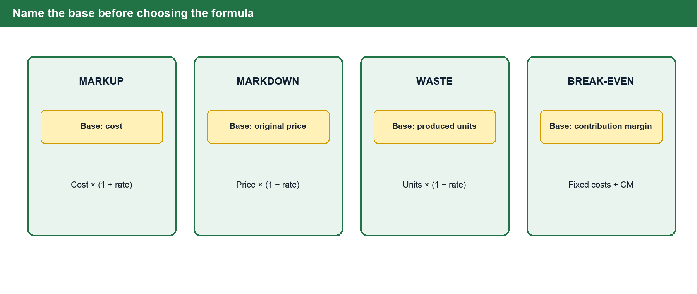
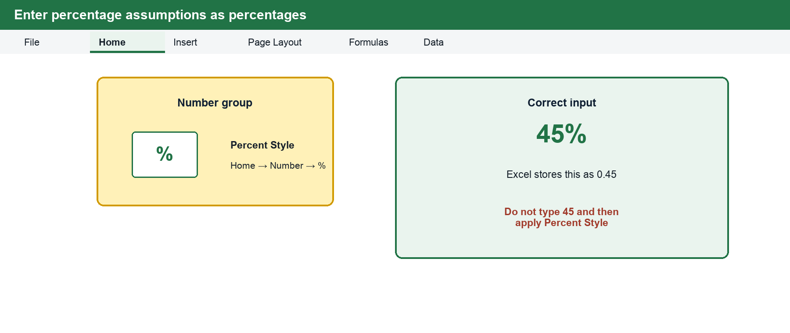
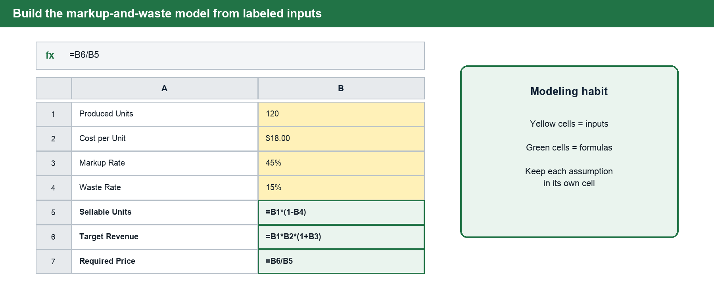
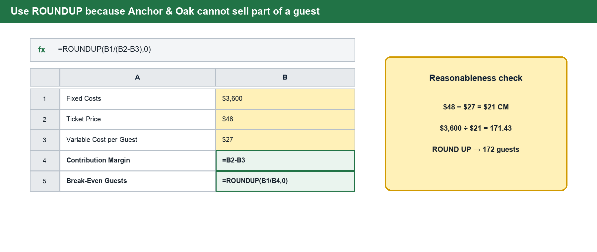

# BUS 123 · MATH-M04-L01 · Markup, Markdown & Break-Even

**Course:** Solving Business Problems with Technology · Fall 2026
**Track:** MATH · **Module:** M04 · **Lesson:** L01
**Case Study Company:** Anchor & Oak Events

---

## 1 · Connect to Prior Knowledge

In the discounts lesson, you started with a list price and reduced it. In this lesson, you often **start with cost and build up to a selling price**. The percentage mechanics are familiar, but the business question changes: will this price cover the cost, reflect the risk, and still make sense to the customer?

---

## 2 · Core Concepts

### Part A — Markup

Markup is the amount added to cost to create a selling price. Anchor & Oak Events may know the ingredient and packaging cost for a tasting box, but that cost is not the price. The price must also cover labor, event preparation, waste, and profit.

A 45% markup on cost means the selling price equals cost plus 45% of cost. In a spreadsheet, this is modeled by placing cost in one cell, markup rate in another, and writing a formula that multiplies cost by one plus the markup rate.

**Selling Price = Cost × (1 + Markup Rate)**

#### Markup on Cost vs. Markup on Selling Price

A common source of confusion is **the base**. The same dollar amount of markup produces a different percentage depending on what you divide by.

| Measure                    | Formula                     | Example ($18 cost, $26.10 price)     |
|----------------------------|-----------------------------|--------------------------------------|
| **Markup Amount**          | Selling Price − Cost        | $26.10 − $18.00 = **$8.10**          |
| **Markup on Cost**         | Markup Amount / Cost        | $8.10 / $18.00 = **45%**             |
| **Markup on Selling Price**| Markup Amount / Selling Price | $8.10 / $26.10 = **31%**           |

Same dollars — different percentage. Whenever you read a business problem, **pause and identify the base** before choosing a formula.

Use this five-step routine throughout the lesson:

1. **Name the business question.** Are you setting a price, reducing a price, accounting for waste, or finding break-even volume?
2. **Identify the base.** Name the amount or unit to which the percentage applies.
3. **Predict the direction.** Decide whether the answer should rise or fall before calculating.
4. **Build the formula.** Keep assumptions in labeled spreadsheet cells instead of typing them inside formulas.
5. **Check the result.** Confirm that the units, direction, and business meaning are reasonable.

---

### Part B — Markdowns and Perishables

Markdowns reduce price after the original price has been set. For an event business, markdowns can help fill late seats or sell perishable items before they lose value. **A markdown is not automatically a failure** — it is a tradeoff: lower margin per sale in exchange for more cash recovery, fuller attendance, or less waste.

**Markdown Price = Original Price × (1 − Markdown Rate)**

#### Waste Changes the Pricing Problem

Perishable products require extra care because not every produced unit may become a sellable unit. If Anchor & Oak produces 120 tasting boxes and expects 15% waste, only 102 boxes are expected to be sold.

> ⚠️ **Key Insight**
>
> The cost of **all 120 boxes** still needs to be recovered from the **102 sellable boxes**. This is why a price that looks profitable before waste can become too low after waste is considered.

**Sellable Units = Produced Units × (1 − Waste Rate)**

---

### Part C — Break-Even

Break-even is the point where **total revenue equals total cost**. Before break-even, the business is losing money on the event. After break-even, each additional unit contributes toward profit.

The key idea is **contribution margin**: selling price minus variable cost per unit. Contribution margin is not the same as profit, because fixed costs still need to be covered first.

**Contribution Margin = Selling Price − Variable Cost per Unit**

**Break-Even Units = Fixed Costs ÷ Contribution Margin per Unit**

> 💡 **The Rounding Rule**
>
> Break-even units must always be **rounded up** to the nearest whole unit. Selling to 171 guests when the break-even is 171.43 would still leave a small loss. Use `=ROUNDUP(result, 0)` in Excel — never round down.

## 3 · Build the Model in Excel

### Enter Percentages Correctly

Enter a rate as `45%` or `0.45`, then use **Home → Number → Percent Style** when needed. Do not type `45` and then apply Percent Style; Excel would display `4500%` because the stored value is forty-five, not forty-five hundredths.

### Separate Inputs From Formulas

Place each assumption in its own labeled cell. This makes the model easier to audit and lets you test a new markup or waste assumption without rewriting formulas. In the model below, yellow cells are inputs and green cells are calculated outputs.

Before accepting the result, predict its direction. Markup should raise price, markdown should lower price, waste should reduce sellable units, and a higher variable cost should increase break-even attendance.

## 4 · Worked Examples

### Worked Example 1 — Markup With Waste

Anchor & Oak plans to produce 120 tasting boxes. Each box costs $18 to prepare, and the target markup is 45% on cost. The business expects 15% waste.

**Step 1 — Target Revenue (assuming all boxes sell):**

Prediction: adding markup should make target revenue greater than the original production cost.

- 120 × $18.00 × 1.45 = **$3,132**

**Step 2 — Sellable Units:**
- 120 × (1 − 0.15) = **102 boxes**

**Step 3 — Required Price per Sellable Box:**

Prediction: waste leaves fewer sellable boxes, so the required price should rise.

- $3,132 ÷ 102 = **$30.71**

Notice what happened: the price rose because fewer sellable boxes must recover the same production cost.

**Excel patterns:** Target Revenue is `=ProducedUnits * CostPerUnit * (1 + MarkupRate)`. Required Price is `=TargetRevenue / SellableUnits`.

---

### Worked Example 2 — Break-Even

Anchor & Oak is considering a tasting event with $3,600 in fixed costs, a $48 ticket price, and $27 variable cost per guest.

**Step 1 — Contribution Margin:**

Prediction: contribution margin must be less than the $48 selling price because variable cost is subtracted from it.

- $48 − $27 = **$21 per guest**

**Step 2 — Break-Even Guests:**
- $3,600 ÷ $21 = 171.43 → round up to **172 guests**

**Excel pattern:** `=ROUNDUP(FixedCost / (TicketPrice - VariableCost), 0)`

Check the result from both directions: 171 guests would produce only `$3,591` of contribution margin, which is not enough to cover `$3,600` of fixed costs. At 172 guests, contribution margin reaches `$3,612`, so the event has crossed break-even.

---

## 5 · Formula Reference

| Concept                        | Formula                                          |
|--------------------------------|--------------------------------------------------|
| **Markup Amount**              | `Selling Price − Cost`                           |
| **Markup on Cost**             | `Markup Amount / Cost`                           |
| **Selling Price (markup)**     | `Cost × (1 + Markup Rate)`                       |
| **Markdown Price**             | `Original Price × (1 − Markdown Rate)`           |
| **Sellable Units**             | `Produced Units × (1 − Waste Rate)`              |
| **Contribution Margin**        | `Selling Price − Variable Cost per Unit`         |
| **Break-Even Units**           | `Fixed Costs / Contribution Margin per Unit`     |
| **Break-Even Revenue**         | `Break-Even Units × Selling Price`               |

### Looking Ahead — Target Profit

Break-even covers costs but produces no profit. When a manager sets a target profit, add that target to fixed costs before dividing by contribution margin:

`=ROUNDUP((FixedCosts + TargetProfit) / ContributionMargin, 0)`

This is an extension of the same model, not a different break-even formula.

---

## 6 · Check Your Understanding

Answer each question before looking at the answer key below. Show your formula setup, not just the final number.

1. A dessert box costs $20 and is marked up 40% on cost. What is the selling price?
2. A $52 ticket is marked down 20%. What is the new price?
3. Anchor & Oak produces 160 favors and expects 10% waste. How many are sellable?
4. An event has a $35 ticket price and $18 variable cost per guest. What is the contribution margin?
5. Fixed cost is $2,400 and contribution margin is $16. How many units are needed to break even?

---

### Answer Key · Check Your Understanding

| # | Answer |
|---|--------|
| **1** | $20 × (1 + 0.40) = $20 × 1.40 = **$28.00** |
| **2** | $52 × (1 − 0.20) = $52 × 0.80 = **$41.60** |
| **3** | 160 × (1 − 0.10) = 160 × 0.90 = **144 favors** |
| **4** | $35 − $18 = **$17 per guest** |
| **5** | $2,400 / $16 = **150 units** (exact — no rounding needed here) |

---

## 7 · Key Vocabulary

| Term                       | Definition                                                                                                        |
|----------------------------|-------------------------------------------------------------------------------------------------------------------|
| **Markup**                 | The amount added to cost to create a selling price.                                                               |
| **Markup on Cost**         | Markup measured as a percentage of cost. Formula: `Markup Amount / Cost`.                                         |
| **Markup on Selling Price**| Markup measured as a percentage of the selling price. Formula: `Markup Amount / Selling Price`.                   |
| **Markdown**               | A reduction from an original selling price. Formula: `Original Price × (1 − Markdown Rate)`.                     |
| **Perishable Inventory**   | Goods or capacity that lose value over time and cannot be held indefinitely for sale.                             |
| **Waste Rate**             | The percentage of produced units expected to be unsellable. Reduces the denominator when calculating required price. |
| **Variable Cost**          | Cost that changes with each additional unit produced or guest served.                                             |
| **Fixed Cost**             | Cost that does not change with production volume in the short run (e.g., venue rental, permits).                  |
| **Contribution Margin**    | Selling price minus variable cost per unit. The amount each unit contributes toward covering fixed costs and profit. |
| **Break-Even Point**       | The sales volume at which total revenue exactly equals total cost; zero profit, zero loss.                        |

---

> 📝 **Bring to Class**
>
> You will use the starter workbook to test the same pricing logic from this reading. Expect short **Live You Try It** pauses for markup, markdown, and break-even formulas before moving into the **Class Challenge**. The challenge is where you combine the formulas and explain whether Anchor & Oak's pricing decision is financially reasonable.
