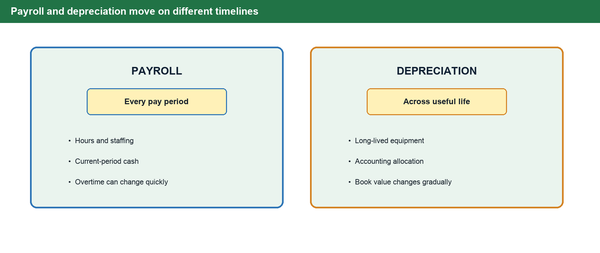
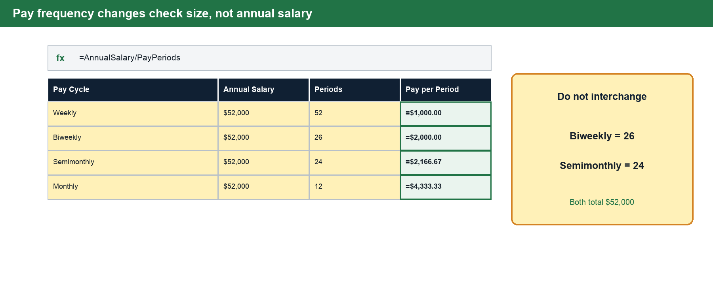
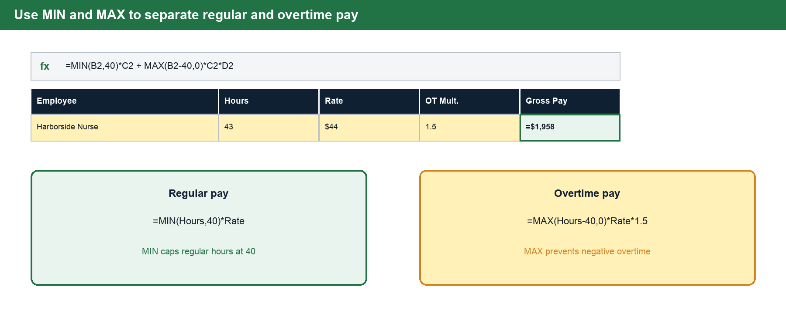
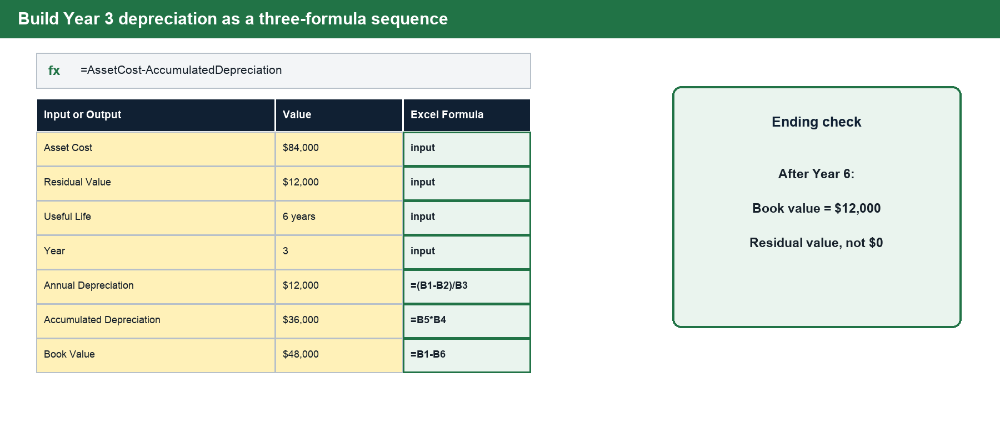
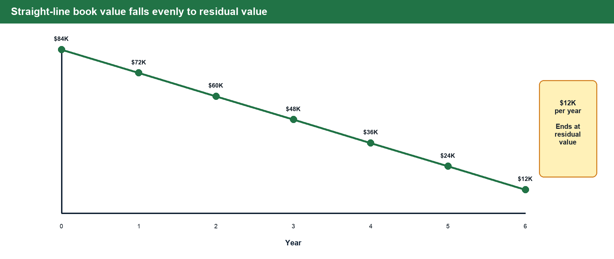

# BUS 123 · MATH-M05-L01 · Payroll and Depreciation

**Course:** Solving Business Problems with Technology · Fall 2026
**Track:** MATH · **Module:** M05 · **Lesson:** L01
**Case Study Company:** Harborside Medical Center

---

## 1 · Connect to Prior Knowledge

Read this briefing before class so the calculations in the live activity feel like business decisions instead of isolated formulas. Harborside Medical Center is deciding how to manage weekly staffing costs while planning for long-lived medical equipment.

Managers need a clean view of two different cost rhythms: **payroll costs** that repeat every pay period, and **asset costs** that are spread across years. Payroll helps Harborside staff patient care safely. Depreciation helps Harborside recognize that equipment wears out, becomes outdated, or loses value over time.

Payroll often involves current cash paid to employees. Depreciation is different: it allocates a prior asset purchase across accounting periods and usually does not represent new cash leaving the bank in the year it is recorded.

---

## 2 · Core Concepts

### Part A — Payroll

#### Key Payroll Vocabulary

| Term             | Meaning for Harborside Medical              | Basic Formula                        |
|------------------|---------------------------------------------|--------------------------------------|
| **Hourly pay**   | Employees paid for hours worked, often with overtime eligibility | `Hours × Rate` |
| **Overtime pay** | Extra pay for hours beyond the regular threshold (commonly 40 hrs/week) | `OT Hours × Rate × 1.5` |
| **Salary**       | Fixed annual pay converted into periodic checks | `Annual Salary / Pay Periods` |
| **Commission**   | Pay based on a percentage of sales, referrals, or measurable revenue | `Sales × Commission Rate` |
| **Gross pay**    | Total earned before deductions              | `Regular + OT + Commission`          |

#### Payroll Cycles

The pay cycle changes the size and timing of a paycheck — not the annual salary. A $52,000 salary can be paid as:

| Cycle          | Periods/Year | Paycheck Amount  |
|----------------|--------------|------------------|
| Weekly         | 52           | $1,000.00        |
| Biweekly       | 26           | $2,000.00        |
| Semimonthly    | 24           | $2,166.67        |
| Monthly        | 12           | $4,333.33        |

**Formula:** `Salary per Period = Annual Salary / Number of Pay Periods`

In Excel, place the annual salary and number of pay periods in separate labeled cells, then use `=AnnualSalary/PayPeriods`.

Biweekly and semimonthly are not interchangeable. Biweekly payroll normally has 26 periods per year; semimonthly payroll has 24. Both still distribute the same annual salary.

#### Overtime Example — Harborside Medical Center

A Harborside nurse earns $44/hour and works 43 hours in one week. The first 40 hours are paid at the regular rate; the 3 overtime hours are paid at time-and-a-half.

- Regular pay: 40 × $44 = **$1,760**
- Overtime pay: 3 × $44 × 1.5 = **$198**
- Gross pay: **$1,958**

### Build Overtime Safely in Excel

Use formulas that handle employees both above and below the overtime threshold:

- Regular pay: `=MIN(Hours,40)*Rate`
- Overtime pay: `=MAX(Hours-40,0)*Rate*1.5`
- Gross pay: `=RegularPay+OvertimePay`

`MIN` caps regular hours at 40. `MAX` prevents a negative overtime result when an employee works fewer than 40 hours. Gross pay is earnings before deductions; it is not take-home pay.

For the eight-nurse team used in class, one nurse earns `$1,958`, so total weekly gross pay is `=8*1958`, or **$15,664**. Keep the employee count in its own input cell so a manager can test a different staffing level without rewriting the pay formula.

> 💡 **Manager Question**
>
> If many employees are working overtime every week, is Harborside solving a temporary staffing issue — or hiding a permanent headcount problem?

#### Pay System Comparison

| Pay System              | Best Fit                                               | Risk to Watch                                      |
|-------------------------|--------------------------------------------------------|----------------------------------------------------|
| **Hourly**              | Patient-care shifts, front desk, variable schedules    | Overtime can rise quickly                          |
| **Salary**              | Managers, billing leaders, ongoing responsibility      | Workload may become invisible                      |
| **Piece rate / per visit** | Task-based work, contract coverage, repeatable services | Volume may be rewarded over quality             |
| **Commission**          | Outreach, referrals, optional service growth           | Revenue incentive may need guardrails              |
| **Salary + commission** | Stable role with a growth target                       | Formula must be transparent                        |

---

### Part B — Depreciation

#### Key Depreciation Vocabulary

| Term                       | Definition                                                                                     |
|----------------------------|-----------------------------------------------------------------------------------------------|
| **Asset cost**             | The purchase price plus costs needed to get the asset ready for use.                          |
| **Residual value**         | Expected value at the end of useful life.                                                     |
| **Useful life**            | How long the company expects to use the asset.                                                |
| **Accumulated depreciation** | Total depreciation recorded so far.                                                        |
| **Book value**             | Asset cost minus accumulated depreciation.                                                    |

Depreciation is an accounting estimate of the cost of a long-lived asset used up during a period. It is **not** the same as cash leaving the bank this year — it helps Harborside match the cost of equipment to the years that benefit from that equipment.

#### Straight-Line Depreciation

Straight-line depreciation spreads the depreciable cost evenly across useful life. Managers like it because it is predictable, easy to explain, easy to audit, and useful when an asset provides steady service.

**Annual Depreciation = (Asset Cost − Residual Value) / Useful Life**

#### Worked Example — Harborside Medical Center

Harborside buys a diagnostic ultrasound unit for $84,000. Expected residual value: $12,000 after 6 years.

- Annual depreciation: ($84,000 − $12,000) / 6 = **$12,000/year**

| Year | Cost    | Depreciation Expense | Accumulated Depreciation | Book Value |
|------|---------|----------------------|--------------------------|------------|
| 1    | $84,000 | $12,000              | $12,000                  | $72,000    |
| 2    | $84,000 | $12,000              | $24,000                  | $60,000    |
| 3    | $84,000 | $12,000              | $36,000                  | $48,000    |
| 4    | $84,000 | $12,000              | $48,000                  | $36,000    |
| 5    | $84,000 | $12,000              | $60,000                  | $24,000    |
| 6    | $84,000 | $12,000              | $72,000                  | $12,000    |

### Build the Depreciation Schedule in Excel

Use three connected formulas:

- Annual depreciation: `=(Cost-ResidualValue)/UsefulLife`
- Accumulated depreciation: `=AnnualDepreciation*Year`
- Book value: `=Cost-AccumulatedDepreciation`

For Year 3, the formulas return `$12,000` annual depreciation, `$36,000` accumulated depreciation, and `$48,000` book value.

Straight-line book value falls evenly and ends at residual value, not zero. Book value is an accounting amount and may differ from the equipment's current market price.

## 3 · Predict Before You Calculate

Use direction checks to catch formulas that return a number but do not make business sense:

1. If hours rise above 40, total payroll should rise faster because overtime hours receive premium pay.
2. If the hourly rate rises, both regular and overtime pay should rise.
3. If useful life increases while cost and residual value stay fixed, annual depreciation should fall.
4. If residual value increases while cost and useful life stay fixed, annual depreciation should fall.
5. At the end of useful life, book value should equal residual value rather than zero.

---

## 4 · Check Your Understanding

Answer these questions before class. Be ready to discuss your reasoning — not just the number.

1. Which payroll type gives Harborside the most flexibility when patient volume changes week to week?
2. Why does overtime make total payroll rise faster than regular hours?
3. If an employee earns a fixed annual salary, why do weekly and monthly paychecks have different dollar amounts?
4. What is the difference between depreciation expense and accumulated depreciation?
5. Why might straight-line depreciation be a good fit for a medical device used steadily throughout the year?
6. What Excel formula calculates weekly pay for a `$52,000` annual salary?
7. Using Excel logic, calculate regular pay, overtime pay, and gross pay for 43 hours at `$44` per hour.
8. What is the total weekly gross pay for 8 nurses working those same hours?
9. For the ultrasound unit, calculate Year 3 accumulated depreciation and book value.
10. A six-year depreciation schedule ends at `$0`. What assumption or formula was probably omitted?

### Self-Check

| # | Expected result |
|---|---|
| 6 | `=52000/52` gives **$1,000 per week**. |
| 7 | Regular pay is **$1,760**, overtime pay is **$198**, and gross pay is **$1,958**. |
| 8 | `=8*1958` gives **$15,664** total weekly gross pay. |
| 9 | Accumulated depreciation is **$36,000** and book value is **$48,000**. |
| 10 | Residual value was probably omitted; ending book value should be **$12,000**. |

---

## 5 · Key Vocabulary

| Term                        | Definition                                                                                                                               |
|-----------------------------|------------------------------------------------------------------------------------------------------------------------------------------|
| **Gross Pay**               | Total earnings before any deductions; includes regular pay, overtime, and commission.                                                    |
| **Overtime Pay**            | Compensation for hours worked beyond the standard threshold (typically 40 hrs/week), calculated at 1.5× the regular hourly rate.         |
| **Pay Period**              | The recurring interval at which employees are paid: weekly, biweekly, semimonthly, or monthly.                                           |
| **Depreciation**            | An accounting allocation of an asset's cost over its useful life; not a cash outflow in the period it is recorded.                       |
| **Straight-Line Depreciation** | A depreciation method that spreads the depreciable cost evenly across all years of useful life.                                       |
| **Residual Value**          | The estimated value of an asset at the end of its useful life; subtracted from cost before computing depreciation.                       |
| **Book Value**              | The remaining recorded value of an asset: Asset Cost − Accumulated Depreciation.                                                         |
| **Accumulated Depreciation**| The running total of all depreciation expense recorded on an asset since it was placed in service.                                       |

---

> 📝 **Bring to Class**
>
> Be ready to use the starter workbook as a payroll and depreciation management system. The **Live You Try It** pauses will use the same salary, overtime, team payroll, and ultrasound depreciation numbers from the slides so you can self-check each formula before moving on.
>
> The **Class Challenge** asks you to combine payroll cost, staffing pressure, depreciation, and business interpretation. Your goal is not only to calculate the new payroll or asset amount, but also to explain whether the decision is **operationally reasonable** for a medical practice.
