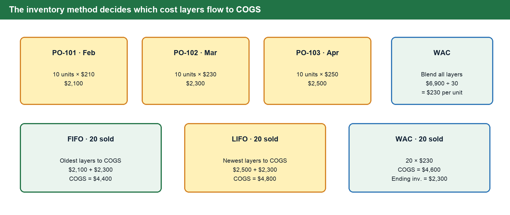
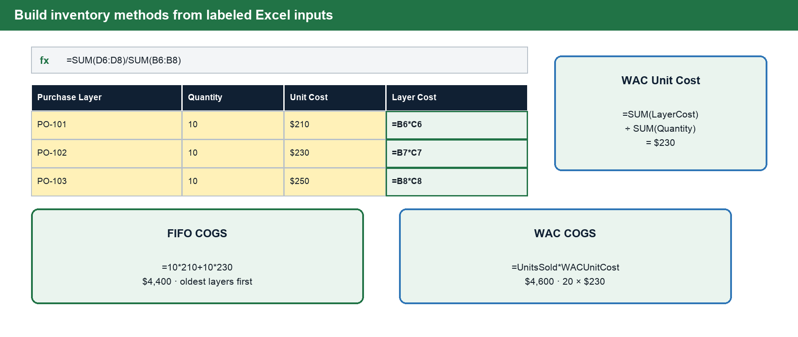
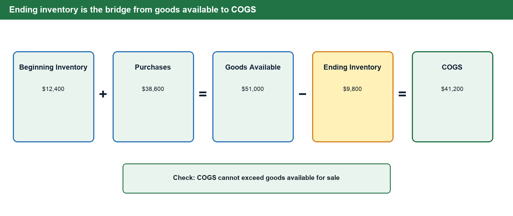
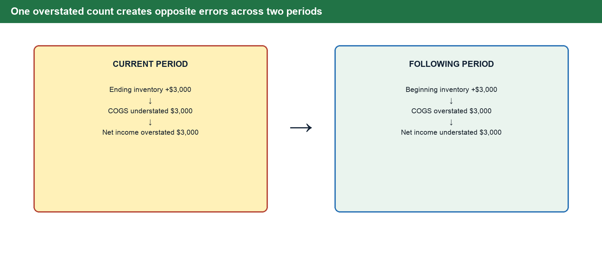
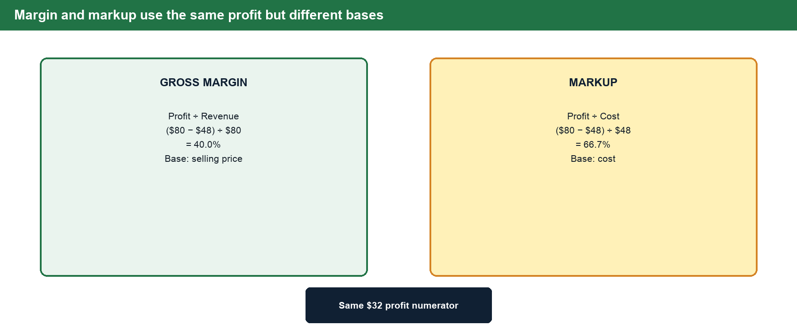
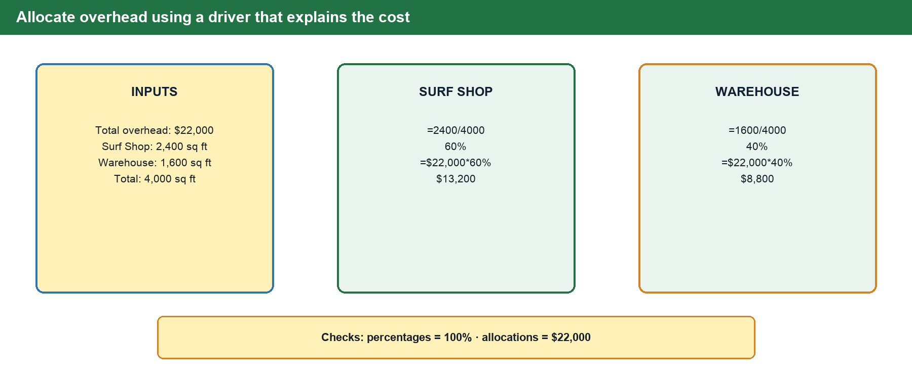

# BUS 123 · MATH-M06-L01 · Inventory, Overhead & Cost of Goods Sold

**Course:** Solving Business Problems with Technology · Fall 2026
**Track:** MATH · **Module:** M06 · **Lesson:** L01
**Case Study Company:** Tidal Goods Co.

---

## 1 · Connect to Prior Knowledge

Earlier in the math track, you learned how retailers use markup to set selling prices from a known cost — how a 50% markup on a $40 item produces a $60 retail price. But markup math assumes you already know the cost of that item with precision.

This module goes one level deeper: **what exactly is the cost of the item you just sold?** When a business carries hundreds of units bought at different prices across different weeks, the answer is not obvious. The method you choose — FIFO, LIFO, or Weighted Average Cost — changes reported COGS, profit, and the asset value on the balance sheet. It can also affect taxable income and taxes under the applicable reporting and tax rules.

Layered on top of product cost are **overhead expenses**: rent, utilities, insurance, and indirect labor that keep the business running but cannot be traced to any single unit sold. Together, these elements feed the **Cost of Goods Sold (COGS)** calculation — the single most important cost line on a product business's income statement.

---

## 2 · Core Concepts

### Part 1 — Inventory Valuation

#### Why Valuation Matters

Tidal Goods Co. is a coastal outdoor retailer selling paddleboards, surf gear, and accessories. Over a single quarter, Tidal places three purchase orders for the same paddleboard model as supplier prices shift due to tariff pressures and shipping costs:

| Purchase Order  | Unit Cost    | Quantity      |
|-----------------|--------------|---------------|
| PO-101 (Feb)    | $210/unit    | 10 units      |
| PO-102 (Mar)    | $230/unit    | 10 units      |
| PO-103 (Apr)    | $250/unit    | 10 units      |

Tidal sells 20 paddleboards during the quarter. The question every accountant must answer: which 20 units' costs flow to the income statement, and which 10 remain on the balance sheet? This is a **formal accounting policy decision** with real financial consequences.

#### The Four Valuation Methods

**Specific Identification** traces each physical unit to its exact purchase cost. This works for unique, high-value items — custom boats, fine jewelry, artwork — but is impractical for any business selling fungible goods in volume.

**First-In, First-Out (FIFO)** assumes the oldest inventory is sold first. Tidal's oldest boards (at $210) flow to COGS before the newer, more expensive ones. During inflation, FIFO produces **lower COGS** and **higher gross profit**. Ending inventory reflects the most recent, higher prices.

**Last-In, First-Out (LIFO)** assumes the newest inventory is sold first. The most recently purchased boards ($250) flow to COGS first. During inflation, LIFO produces **higher COGS** and **lower taxable income** — a cash flow advantage. However, LIFO is **prohibited under IFRS**, making it unavailable to companies that report under international rules.

**Weighted Average Cost (WAC)** calculates a single blended unit cost by dividing total cost available by total units available. It smooths out price fluctuations and is popular for commodity-type goods.

> ✅ **WAC Unit Cost Formula**
>
> `WAC Unit Cost = Total Cost of Goods Available / Total Units Available`
>
> Tidal: ($2,100 + $2,300 + $2,500) / 30 units = **$230.00/unit**
> COGS (WAC): 20 units × $230.00 = **$4,600**

#### The Numbers Side by Side

| Method | COGS                              | Ending Inventory              |
|--------|-----------------------------------|-------------------------------|
| **FIFO** | 10×$210 + 10×$230 = **$4,400** | $2,500 (10 units × $250)     |
| **LIFO** | 10×$250 + 10×$230 = **$4,800** | $2,100 (10 units × $210)     |
| **WAC**  | 20 × $230.00 = **$4,600**      | $2,300 (10 units × $230)     |

The $400 spread between FIFO and LIFO COGS is not rounding — it is a direct result of the accounting policy chosen. Both methods describe the same 20 boards sold from the same physical stockroom. This is why the choice of inventory method is a **strategic management decision**, not just a bookkeeping detail.

#### Build the Inventory Methods in Excel

Enter each purchase layer's quantity and unit cost in separate labeled cells. Calculate each layer's cost with `=Quantity*UnitCost`. Then use:

- WAC unit cost: `=SUM(LayerCostCells)/SUM(QuantityCells)`
- WAC COGS: `=UnitsSold*WACUnitCost`
- FIFO COGS for 20 boards: `=10*210+10*230`

Before accepting the result, confirm that units assigned to COGS plus units in ending inventory equal total units available.

**LIFO and international reporting:** LIFO is permitted under U.S. GAAP but prohibited under IFRS. Changing reporting frameworks may require substantial accounting-policy and comparative-reporting work; exact tax and reporting consequences depend on the rules that apply to the company.

---

### Part 2 — Cost of Goods Sold (COGS)

#### The Core Formula

COGS is the total direct cost of the products a business sold during a period. For a retailer like Tidal, this means the purchase cost of every item that left the store or shipped to a customer.

**Beginning Inventory + Purchases − Ending Inventory = COGS**

In plain English: start with what you had, add what you bought, subtract what is left, and the result is what you sold.

#### Tidal Goods Co. — Q1 2026

| Line Item              | Amount     |
|------------------------|------------|
| Beginning Inventory    | $12,400    |
| + Purchases            | $38,600    |
| = Goods Available      | $51,000    |
| − Ending Inventory     | ($9,800)   |
| **= COGS**             | **$41,200**|
| Revenue                | $110,000   |
| = Gross Profit         | $68,800    |
| Gross Margin %         | 62.5%      |

#### Why Ending Inventory Accuracy Is Critical

Notice that ending inventory **directly reduces COGS**. If the physical count at period end is wrong — even by a small amount — COGS is wrong, which means gross profit is wrong, which means net income is wrong. Worse, that error does not disappear: the ending inventory of this period becomes the beginning inventory of the next period, carrying the error forward.

> ⚠️ **Common Mistake — Overstated Ending Inventory**
>
> If Tidal's count overstates ending inventory by $5,000:
> - **Period 1:** COGS understated by $5,000 → net income **OVERSTATED** by $5,000
> - **Period 2:** Beginning inventory now too high → COGS overstated → net income **UNDERSTATED**
>
> The errors cancel over two periods — but both periods reported false numbers.

---

### Part 3 — Margin vs. Markup

Both margin and markup measure profitability from the same transaction. They use the same inputs — revenue and cost — but **divide by different denominators**. Confusing them is one of the most common and costly errors in retail pricing.

| Measure           | Formula                     | Tidal Example ($80 price, $48 cost) | Result  | Used By              |
|-------------------|-----------------------------|--------------------------------------|---------|----------------------|
| **Gross Margin**  | `(Revenue − Cost) / Revenue` | ($80 − $48) / $80                  | **40.0%** | Finance, investors |
| **Markup**        | `(Revenue − Cost) / Cost`    | ($80 − $48) / $48                  | **66.7%** | Buyers, sales teams|

A buyer who says "we mark up everything 100%" means the selling price is double the cost. That sounds like 100% profit — but the gross margin is only **50%**, because margin divides by the larger selling price. A pricing team that confuses the two will systematically underprice every product in the catalog.

In Excel, use `=(Revenue-Cost)/Revenue` for margin and `=(Revenue-Cost)/Cost` for markup. Format both results as percentages and verify that the denominator matches the business question.

#### Quick Check — Converting Between Them

- Given markup of 66.7%: `Margin = Markup / (1 + Markup)` = 0.667 / 1.667 = **40%**
- Given margin of 40%: `Markup = Margin / (1 − Margin)` = 0.40 / 0.60 = **66.7%**

---

### Part 4 — Overhead Allocation

#### What Is Overhead?

Overhead costs are indirect, recurring expenses required to keep the business operational that **cannot be traced to any single unit sold**.

Tidal's monthly overhead:

| Category         | Monthly Amount |
|------------------|---------------|
| Rent             | $9,000        |
| Utilities        | $4,200        |
| Insurance        | $3,800        |
| Indirect labor   | $3,500        |
| Maintenance      | $1,500        |
| **Total**        | **$22,000**   |

Whether Tidal sells one board or one thousand, these costs exist.

#### Allocating Across Departments

Tidal operates two departments: a retail Surf Shop (2,400 sq ft) and an Online Warehouse (1,600 sq ft). Most overhead categories are allocated by **square footage**, because those costs increase with physical space.

| Department    | Sq Ft         | Allocation Basis | Overhead Allocated        |
|---------------|---------------|------------------|---------------------------|
| Surf Shop     | 2,400 / 4,000 = 60% | Sq footage  | 60% × $22,000 = **$13,200** |
| Warehouse     | 1,600 / 4,000 = 40% | Sq footage  | 40% × $22,000 = **$8,800**  |
| **Total**     | 100%          |                  | **$22,000**               |

Always verify that department percentages total **100%** and allocated amounts total the original overhead. A complete-looking allocation that does not reconcile is not ready for a management report.

#### The Overhead Rate

`Overhead Rate = Total Overhead / Revenue = $22,000 / $110,000 = 20.0%`

A 20% overhead rate means that for every dollar of revenue Tidal earns, **20 cents goes to keeping the lights on** before COGS is even considered. When this rate rises unexpectedly, management investigates: Did rent increase? Did revenue drop while fixed costs stayed flat?

> ✅ **Choosing the Right Allocation Basis**
>
> - **Square footage** — works well for space-based costs (rent, utilities, insurance)
> - **Revenue share** — works better for costs driven by sales volume (commissions, processing fees)
> - **Direct labor hours** — works best for labor-intensive production overhead
>
> The key: the basis should reflect **what actually drives the cost**.

---

## 3 · Predict Before You Calculate

Use these direction checks before trusting an Excel result:

1. During rising prices, FIFO should produce lower COGS than LIFO because older costs are lower.
2. If ending inventory rises while beginning inventory and purchases stay fixed, COGS should fall.
3. If revenue falls while overhead remains fixed, the overhead rate should rise.
4. For the same profitable sale, markup percentage should be larger than margin percentage because cost is the smaller denominator.
5. Department allocation percentages must total 100%, and allocated dollars must total the original overhead.

## 4 · Formula Reference

| Formula               | Expression                         | Tidal Goods Example                          |
|-----------------------|------------------------------------|----------------------------------------------|
| **COGS**              | `=BeginningInventory+Purchases-EndingInventory` | $12,400 + $38,600 − $9,800 = **$41,200** |
| **Goods Available**   | `=BeginningInventory+Purchases`    | $12,400 + $38,600 = **$51,000**              |
| **Gross Profit**      | `=Revenue-COGS`                    | $110,000 − $41,200 = **$68,800**             |
| **Gross Margin %**    | `=GrossProfit/Revenue`              | $68,800 / $110,000 = **62.5%**               |
| **Markup %**          | `=(Revenue-Cost)/Cost`              | ($80 − $48) / $48 = **66.7%**                |
| **WAC Unit Cost**     | `=TotalCostAvailable/TotalUnitsAvailable` | $6,900 / 30 = **$230.00**               |
| **FIFO COGS**         | `Oldest units × oldest cost`       | 10×$210 + 10×$230 = **$4,400**               |
| **Dept OH %**         | `Dept Sq Ft / Total Sq Ft`         | 2,400 / 4,000 = **60%**                      |
| **OH Allocated**      | `=TotalOverhead*DeptPercent`        | $22,000 × 60% = **$13,200**                  |
| **OH Rate**           | `=TotalOverhead/Revenue`            | $22,000 / $110,000 = **20.0%**               |

---

## 5 · Check Your Understanding

Answer all seven questions before class. Answers appear at the end of this document.

1. Tidal Goods Co. had beginning inventory of $14,000, made purchases of $32,000 during the quarter, and ended with inventory of $11,500. Calculate COGS.

2. Using the paddleboard purchase orders in Part 1 (10 units at $210, 10 at $230, 10 at $250), calculate the COGS if Tidal sells 15 units using the **FIFO** method.

3. Using the same purchase orders, calculate the Weighted Average Cost per unit and the COGS for selling 15 units under **WAC**.

4. Tidal sells a wetsuit for $120. The landed cost is $72. Calculate both the **gross margin percentage** and the **markup percentage**.

5. Tidal's overhead for the month is $18,000. Revenue is $90,000. Calculate the overhead rate. If revenue drops to $75,000 next month but overhead stays flat, what is the new overhead rate?

6. Tidal's Surf Shop occupies 3,000 sq ft and the Warehouse occupies 2,000 sq ft. Monthly rent is $10,000. How much rent should be allocated to each department?

7. Tidal's ending inventory count is accidentally overstated by $3,000 this quarter. Explain what happens to COGS and net income this period, and what happens in the following period as a result.

---

### Answer Key · Check Your Understanding

| # | Answer |
|---|--------|
| **1** | COGS = $14,000 + $32,000 − $11,500 = **$34,500** |
| **2** | FIFO — sell oldest first: 10 units × $210 + 5 units × $230 = $2,100 + $1,150 = **$3,250** |
| **3** | WAC unit cost = ($2,100 + $2,300 + $2,500) / 30 = **$230.00**. COGS = 15 × $230.00 = **$3,450** |
| **4** | Gross Margin = ($120 − $72) / $120 = **40.0%**. Markup = ($120 − $72) / $72 = **66.7%** |
| **5** | Current: $18,000 / $90,000 = **20.0%**. If revenue drops: $18,000 / $75,000 = **24.0%** — same overhead, less revenue to absorb it. |
| **6** | Surf Shop: 3,000 / 5,000 = 60% × $10,000 = **$6,000**. Warehouse: 2,000 / 5,000 = 40% × $10,000 = **$4,000**. |
| **7** | This period: ending inventory overstated by $3,000 → COGS understated → net income **overstated** by $3,000. Next period: beginning inventory too high → COGS overstated → net income **understated** by $3,000. The errors offset over two periods, but both periods reported incorrect figures. |

---

## 6 · Key Vocabulary

| Term                          | Definition                                                                                                                                              |
|-------------------------------|---------------------------------------------------------------------------------------------------------------------------------------------------------|
| **Cost of Goods Sold (COGS)** | The direct cost of products sold during a period. Calculated as: Beginning Inventory + Purchases − Ending Inventory.                                    |
| **FIFO**                      | First-In, First-Out. Inventory method that assumes the oldest inventory is sold first. Produces lower COGS and higher profit during inflationary periods. |
| **LIFO**                      | Last-In, First-Out. Inventory method that assumes the newest inventory is sold first. Produces higher COGS and lower taxable income. Prohibited under IFRS. |
| **Weighted Average Cost (WAC)** | Inventory method that calculates a single blended unit cost by dividing total cost available by total units available.                                 |
| **Gross Margin**              | Profit expressed as a percentage of revenue: `(Revenue − Cost) / Revenue`. Used by finance teams and investors.                                         |
| **Markup**                    | Profit expressed as a percentage of cost: `(Revenue − Cost) / Cost`. Used by purchasing and sales teams to set prices from known costs.                 |
| **Overhead**                  | Indirect, recurring costs that keep the business operational but cannot be traced to any single unit sold.                                              |
| **Overhead Allocation**       | The process of distributing shared overhead costs across departments using a practical basis such as square footage or revenue share.                    |
| **Overhead Rate**             | Total overhead costs as a percentage of revenue. A rising rate signals cost control issues or falling revenue.                                          |
| **Goods Available for Sale**  | Beginning Inventory + Purchases. The total inventory that could have been sold; COGS cannot exceed this figure.                                         |

---

> 📝 **Bring to Class**
>
> Be ready to turn Tidal Goods Co.'s raw transaction information into a management report. The class activity will ask you to build a COGS schedule, compare inventory methods, calculate margin versus markup, and allocate overhead in a way a manager could explain.
