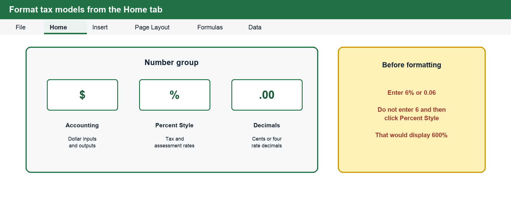
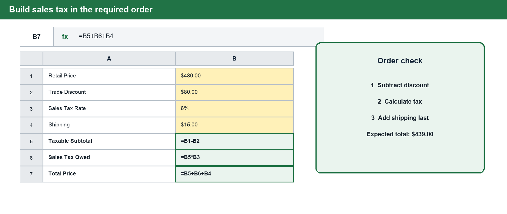
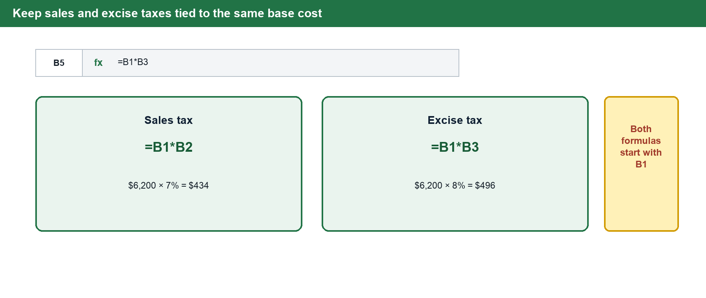
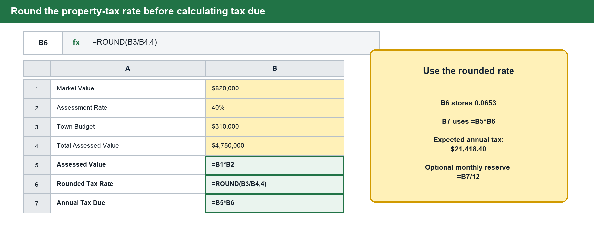

# BUS 123 · MATH-M07-L01 · Sales, Excise & Property Taxes

**Course:** Solving Business Problems with Technology · Fall 2026
**Track:** MATH · **Module:** M07 · **Lesson:** L01
**Case Study Companies:** Tidal Goods Co. · Meridian Advisory Group

---

## 1 · Connect to Prior Knowledge

In the previous module, you learned how businesses set selling prices — applying trade discounts to reduce the retail price before quoting a buyer, and marking up costs to establish a profitable price point. You built those calculations in Excel using cell references so that any change in an input automatically updated the entire chain.

This lesson adds a critical layer: **government taxes.** Once a price is set, taxes are applied at specific points in a defined order — and getting that order wrong produces incorrect totals, incorrect revenue reporting, and potential legal liability. Today we examine three distinct tax types — sales, excise, and property — each of which places a different obligation on the business.

---

## 2 · Core Concepts

### Part 1 — Sales Tax

#### What Is Sales Tax?

Sales tax is a broad-based consumption tax levied by state governments on the retail sale of goods and certain services. Every state sets its own rate; some municipalities add a local surcharge on top. As of 2024, state rates range from **0%** (Oregon, Montana, New Hampshire, Delaware, Alaska) to **over 7%** before local additions.

> ⚠️ **The Merchant's Role**
>
> When a business collects sales tax from a customer, those funds are **NOT revenue**. They are a **liability held in trust** for the state government. The business is acting as a collection agent. Misclassifying collected tax as earned revenue is a serious accounting error.

#### The Order of Operations

The calculation sequence is strictly defined. Trade discounts reduce the taxable base — they **must** come before tax is calculated. Shipping charges are added **after** tax has been computed. Reversing these steps produces an incorrect tax figure.

| Step | Operation                              | Formula                              |
|------|----------------------------------------|--------------------------------------|
| 1    | Subtract trade discount from retail price | `Taxable = Price − Discount`      |
| 2    | Apply tax rate to taxable subtotal     | `Tax = Taxable × Rate`               |
| 3    | Add shipping to get total price        | `Total = Taxable + Tax + Shipping`   |

#### Worked Example — Tidal Goods Co.

Tidal Goods Co. sells a bulk supply order to a wholesale partner. Retail price: $480.00. Trade discount: $80.00. Sales tax: 6%. Flat shipping: $15.00.

| Item                       | Amount    |
|----------------------------|-----------|
| Retail Price               | $480.00   |
| Less: Trade Discount       | −$80.00   |
| **Taxable Subtotal**       | **$400.00** |
| × Sales Tax Rate (6%)      | × 0.06    |
| Tax Owed                   | $24.00    |
| Taxable Subtotal + Tax     | $424.00   |
| + Shipping                 | +$15.00   |
| **Total Price**            | **$439.00** |

#### Back-Calculating Actual Sales

When a retailer's register total includes both sales revenue and collected tax, the actual pre-tax revenue must be isolated:

**`Actual Sales = Total Receipts / (1 + Tax Rate)`**

**Example:** Tidal Goods Co.'s register shows $52,000 in total daily receipts at a 6% tax rate.
- Actual sales = $52,000 ÷ 1.06 = **$49,056.60**
- The remaining **$2,943.40** belongs to the state.

---

### Part 2 — Excise Tax

#### What Is Excise Tax?

Excise tax is a targeted, selective tax applied to specific categories of goods considered luxuries or nonessentials — fuel, alcohol, tobacco, certain appliances, firearms, and air travel. Unlike sales tax, which is collected at the retail register, excise tax is typically **paid upstream by manufacturers or wholesalers** and is already embedded in the sticker price by the time it reaches a consumer.

> 💡 **Strategic Impact**
>
> Because excise tax raises the cost of acquiring inventory, it directly compresses gross margin. Managers must evaluate **demand elasticity** — whether the market will absorb a price increase — before passing the cost to customers.

#### When Both Taxes Apply — Never Compound Them

When both sales tax and excise tax apply to the same item, each is calculated **independently from the original base cost**. The rates are not compounded (do not apply the second tax to the already-taxed amount).

#### Worked Example — Meridian Advisory Group

Meridian Advisory Group purchases a commercial appliance for $6,200. Sales tax: 7%. Excise tax: 8%.

| Tax Type          | Calculation         | Amount      |
|-------------------|---------------------|-------------|
| Base Cost         | Given               | $6,200.00   |
| Sales Tax (7%)    | $6,200 × 0.07       | $434.00     |
| Excise Tax (8%)   | $6,200 × 0.08       | $496.00     |
| **Total Cost**    | $6,200 + $434 + $496 | **$7,130.00** |

> ✅ **Shortcut**
>
> Add the two rates first (7% + 8% = 15%), then multiply: $6,200 × 1.15 = **$7,130**. This works because both rates apply to the same base — they can be combined before multiplying.

---

### Part 3 — Property Tax

#### What Is Property Tax?

Property tax is collected by local municipalities to fund community services: schools, roads, fire and police protection, public libraries, and infrastructure. It applies to both **real property** (land and buildings) and **business personal property** (movable assets such as computers, furniture, and machinery).

Municipalities do not tax property at its full market value. Instead, they apply an **assessment rate** to calculate a lower **assessed value**, which is the taxable base.

> ⚠️ **Triple Net Lease (NNN) Warning**
>
> In a NNN lease, the **tenant** — not the landlord — pays property taxes, building insurance, and maintenance. This makes the tenant's effective rent variable, tied directly to the municipality's annual budget. A town that approves a larger budget raises every NNN tenant's costs automatically.

#### The Three-Step Calculation

| Step | What You Calculate | Formula                                         |
|------|--------------------|-------------------------------------------------|
| 1    | Assessed Value     | `Assessment Rate × Market Value`               |
| 2    | Tax Rate           | `ROUND(Town Budget / Total Assessed Value, 4)` |
| 3    | Annual Tax Due     | `Tax Rate × Assessed Value`                    |

#### Worked Example — Meridian Advisory Group

Given: Market Value $820,000 · Assessment Rate 40% · Town Budget $310,000 · Total Assessed Value in Town $4,750,000

| Step                         | Calculation                     | Result        |
|------------------------------|---------------------------------|---------------|
| 1 — Assessed Value           | 0.40 × $820,000                 | $328,000.00   |
| 2 — Tax Rate (raw)           | $310,000 / $4,750,000           | 0.0652631…    |
| 2 — Tax Rate (rounded)       | `=ROUND(rate, 4)`               | **0.0653**    |
| 3 — Annual Tax Due           | 0.0653 × $328,000               | **$21,418.40**|

---

## 3 · Build the Tax Models in Excel

Excel should mirror the order of the business calculation. Keep every assumption in its own labeled input cell, then build formulas that reference those cells. In the examples below, **yellow cells are inputs** and **green cells are formulas**.

> 💻 **Windows and Mac Excel**
>
> The images show Windows Excel. Mac Excel uses the same commands and formula syntax, although a button may appear in a slightly different position on the ribbon.

### Format Dollar Amounts and Rates

Use **Home → Number** to format prices, taxes, and totals as Accounting or Currency. Format tax and assessment rates as percentages. Enter `6%` or `0.06`—do not enter `6` and then click Percent Style, because Excel would display `600%`.

### Walkthrough 1 — Build the Sales Tax Formula Chain

Set up this model in a blank area of Excel. The cell addresses below are an example; the important requirement is that your formulas reference the cells containing the inputs.

1. **Set up:** In column A, enter the labels Retail Price, Trade Discount, Sales Tax Rate, Shipping, Taxable Subtotal, Sales Tax Owed, and Total Price. In cells B1:B4, enter `$480`, `$80`, `6%`, and `$15`.
2. **Select and type:** Select B5 and type `=B1-B2`. Select B6 and type `=B5*B3`. Select B7 and type `=B5+B6+B4`.
3. **Format:** Format B1:B2 and B4:B7 as Accounting or Currency. Format B3 as Percentage.
4. **Check:** B5 should equal **$400.00**, B6 should equal **$24.00**, and B7 should equal **$439.00**. The total must be greater than the taxable subtotal because tax and shipping were added.
5. **Try:** Change the trade discount in B2 from `$80` to `$100`. The taxable subtotal, tax, and total should all update automatically.

> ⚠️ **Order Matters**
>
> Subtract the trade discount first, calculate tax second, and add shipping last. Do not calculate tax from the original retail price when a trade discount reduces the taxable base.

### Walkthrough 2 — Keep Sales and Excise Taxes on the Same Base

1. **Set up:** Enter Base Cost in A1, Sales Tax Rate in A2, and Excise Tax Rate in A3. Enter `$6,200`, `7%`, and `8%` in B1:B3.
2. **Select and type:** In B4, calculate sales tax with `=B1*B2`. In B5, calculate excise tax with `=B1*B3`. In B6, calculate total cost with `=B1+B4+B5`.
3. **Check:** B4 should equal **$434.00**, B5 should equal **$496.00**, and B6 should equal **$7,130.00**.
4. **Confirm with a second method:** In another cell, type `=B1*(1+B2+B3)`. It should also return **$7,130.00**.
5. **Try:** Change the excise tax rate to `9%`. Both the excise tax and total cost should rise, but the sales tax should remain unchanged.

If the excise formula begins with the sales-tax-inclusive total instead of B1, the taxes are being compounded incorrectly. Both tax formulas must point back to the original base cost.

### Walkthrough 3 — Round the Property Tax Rate First

1. **Set up:** Enter Market Value, Assessment Rate, Town Budget, and Total Assessed Value in A1:A4. Enter `$820,000`, `40%`, `$310,000`, and `$4,750,000` in B1:B4.
2. **Select and type:** In B5, type `=B1*B2` for assessed value. In B6, type `=ROUND(B3/B4,4)` for the tax rate. In B7, type `=B5*B6` for annual tax due.
3. **Format:** Format B1, B3:B5, and B7 as Accounting or Currency. Format B2 as Percentage. Display B6 as a number with four decimal places so you can verify the required rounding.
4. **Check:** B5 should equal **$328,000.00**, B6 should equal **0.0653**, and B7 should equal **$21,418.40**.
5. **Try:** Calculate a monthly NNN planning reserve in B8 with `=B7/12`. The result should be **$1,784.87** when displayed to two decimal places.

> ✅ **Workbook Connection**
>
> In class, use the same modeling habits on the **Live You Try It** tab of the starter workbook. Use the **FormulaReferenceCard** tab when you need a syntax reminder. Complete the **Class Challenge** only when your instructor directs you to begin the graded work.

---

## 4 · Formula Reference

| Formula Name                    | Expression                                              |
|---------------------------------|---------------------------------------------------------|
| **Sales Tax — Taxable Subtotal**| `= Price − Trade Discount`                             |
| **Sales Tax — Tax Owed**        | `= Taxable × Tax Rate`                                 |
| **Sales Tax — Total Price**     | `= Taxable + Tax + Shipping`                           |
| **Back-Calculate Actual Sales** | `= Total Receipts / (1 + Tax Rate)`                   |
| **Excise — Each tax separately**| `= Base × SalesRate` and `= Base × ExciseRate`        |
| **Excise — Combined shortcut**  | `= Base × (1 + SalesRate + ExciseRate)`               |
| **Property — Assessed Value**   | `= Assessment Rate × Market Value`                    |
| **Property — Tax Rate**         | `= ROUND(Town Budget / Total Assessed Value, 4)`      |
| **Property — Annual Tax Due**   | `= Tax Rate × Assessed Value`                         |

---

## 5 · Check Your Understanding

Answer all seven questions before class. Answers appear at the end of this document.

1. **[Calculation]** Tidal Goods Co. sells an order priced at $600. The buyer receives a $100 trade discount. Sales tax is 5.5%. Shipping is $18. What is the taxable subtotal and the total price?

2. **[Concept]** A merchant collects $4,200 in sales tax over a week. Is that $4,200 the merchant's revenue? Explain why or why not.

3. **[Calculation]** Register receipts total $78,000 for the day, inclusive of 7% sales tax. What were the actual pre-tax sales?

4. **[Calculation]** Meridian Advisory Group buys office equipment for $8,500. Sales tax is 6.5% and excise tax is 9%. Calculate the total cost using both methods (separate and combined rate).

5. **[Concept]** Why is it incorrect to apply excise tax to the sales-tax-inclusive amount rather than the base cost?

6. **[Calculation]** A property has a market value of $450,000. Assessment rate: 35%. Town budget: $198,000. Total assessed value in town: $2,600,000. Calculate assessed value, tax rate (to 4 decimal places), and annual tax due.

7. **[Strategy]** Meridian Advisory Group is considering a Triple Net (NNN) lease for new office space. Why should they research the municipality's budget trend before signing? What specific financial risk does an NNN lease create?

---

### Answer Key · Check Your Understanding

| # | Answer |
|---|--------|
| **1** | Taxable = $600 − $100 = $500. Tax = $500 × 0.055 = $27.50. Total = $500 + $27.50 + $18 = **$545.50** |
| **2** | No. Collected sales tax is a **liability held in trust** for the state government, not earned revenue. Recording it as revenue overstates income. |
| **3** | $78,000 / 1.07 = **$72,897.20**. Collected tax = $78,000 − $72,897.20 = $5,102.80. |
| **4** | Method 1: ST = $552.50; ET = $765.00. Total = **$9,817.50**. Method 2: $8,500 × 1.155 = **$9,817.50**. Both match. |
| **5** | Both excise and sales tax are calculated from the **original base price** — not compounded. Applying the second tax to an already-taxed amount overstates the total and inflates cost of goods. |
| **6** | Assessed Value = 0.35 × $450,000 = $157,500. Tax Rate = ROUND($198,000/$2,600,000, 4) = **0.0762**. Annual Tax = 0.0762 × $157,500 = **$12,001.50**. |
| **7** | Under NNN, the tenant bears property tax, insurance, and maintenance. If the town's budget increases, the tax rate rises and the tenant's costs increase with no cap. An NNN lease converts a **fixed rent into variable overhead** — the tenant assumes the risk of local government spending. |

---

## 6 · Key Vocabulary

| Term                          | Definition                                                                                                                                                         |
|-------------------------------|--------------------------------------------------------------------------------------------------------------------------------------------------------------------|
| **Sales Tax**                 | A state-imposed consumption tax on the retail sale of goods and services; collected by merchants on behalf of the government.                                       |
| **Trade Discount**            | A reduction from the retail price given to a business buyer; subtracted **before** sales tax is applied.                                                           |
| **Excise Tax**                | A targeted tax on specific goods (fuel, alcohol, tobacco, luxury appliances) typically paid upstream by manufacturers and embedded in the price.                   |
| **Assessed Value**            | The dollar value assigned to a property for tax purposes: `Assessment Rate × Market Value`.                                                                        |
| **Assessment Rate**           | The percentage of a property's market value that a municipality designates as taxable.                                                                             |
| **Tax Rate (Property)**       | The rate applied to assessed value to calculate tax due: `Town Budget ÷ Total Assessed Value`; rounded to four decimal places.                                    |
| **Nexus**                     | The legal connection (physical presence or economic activity) that requires a business to collect and remit sales tax in a given jurisdiction.                     |
| **Triple Net Lease (NNN)**    | A lease where the tenant pays property taxes, insurance, and maintenance in addition to base rent — shifting operating cost risk from landlord to tenant.          |
| **Business Personal Property**| Movable, tangible operating assets (computers, furniture, machinery) subject to local property tax.                                                               |
| **Demand Elasticity**         | The sensitivity of customer demand to price changes; relevant to excise tax when businesses must raise prices to maintain margin.                                   |
