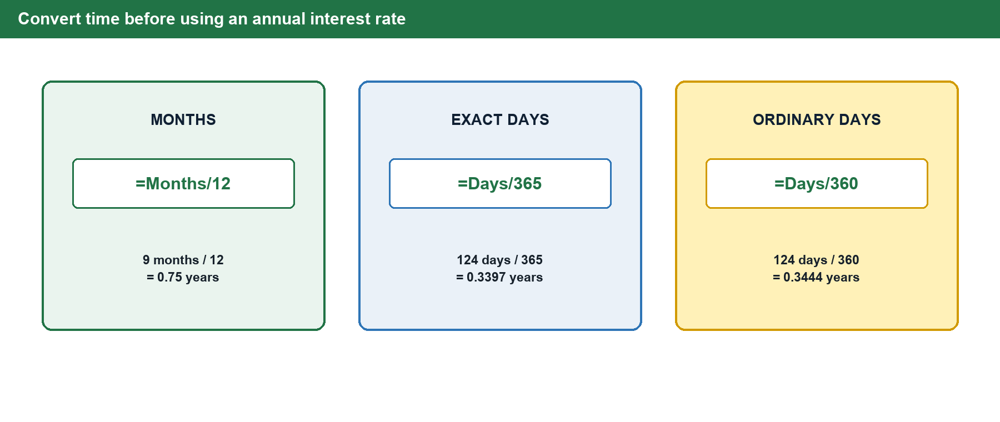
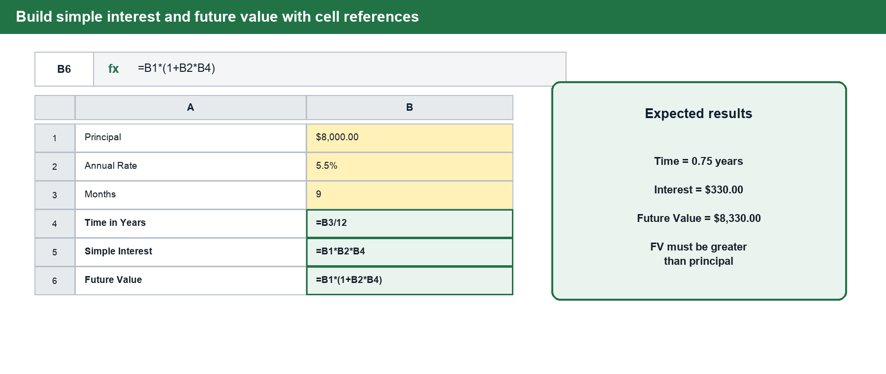
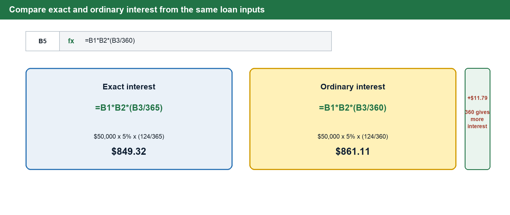
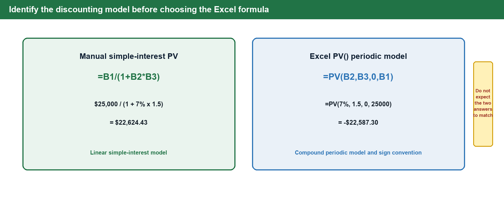

# BUS123 · MATH-M08 · L01 Pre-Reading
## Simple Interest, Discounting & Present Value

**Course:** Solving Business Problems with Technology · BUS123
**Track:** MATH · Module 08 · Lesson 01
**Semester:** Fall 2026 · Gerrish School of Business, Endicott College
**Case Study Company:** Meridian Advisory Group *(fictional — all data simulated for instructional purposes)*

---

## Connect to Prior Knowledge

In the modules leading up to M08, you worked with percentages and proportional change — markup rates, markdown percentages, and ratio comparisons. A rate was a label: it described a change relative to a base amount at a single point in time.

Starting today, a rate becomes an **engine**. When a business borrows money or holds cash in a reserve account, the rate no longer just changes a price — it generates a dollar amount that grows the longer time passes. This module builds the first and simplest version of that relationship: **Simple Interest**, the foundation for all of business finance.

We also introduce the concept that makes financial advisors indispensable: **discounting**. Money promised in the future is worth less than money in hand today, and the difference can be calculated precisely. By the end of this lesson, you will be able to quantify that gap and apply it to real client scenarios.

---

## Core Concepts

### Part A — Why a Dollar Today Is Worth More Than a Dollar Tomorrow

The **Time Value of Money (TVM)** is the principle that money available today is worth more than the same dollar amount promised in the future. Three economic forces explain why:

| Force | Explanation |
|---|---|
| **Opportunity Cost** | Money today can be invested immediately and begin earning a return. A dollar promised next year cannot earn anything until it arrives. |
| **Inflation** | Prices tend to rise over time. The same dollar amount will buy slightly less in the future than it does today. |
| **Risk** | Future promises can fail. A payment guaranteed today carries no uncertainty; a future payment might not arrive at all. |

> 💡 **The So What**
>
> When a financial advisor at Meridian evaluates a client's future payment stream, they don't just add up the dollar amounts. They ask: *what are these future dollars worth **today**, given the client's opportunity cost and the risk of waiting?* That calculation — discounting — is what you will build in today's activity.

The interest rate used in TVM calculations is not arbitrary. It is a sum:

**Total Discount Rate = Inflation Rate + Real Interest Rate + Risk Premium**

Each component has economic meaning. A 7% discount rate might represent 3% inflation, 2% real return for waiting, and 2% compensation for risk. Choosing the right rate is one of the most consequential judgments in financial analysis.

---

### Part B — Simple Interest: Moving Money Forward

Simple interest calculates interest earned on a **principal amount** using a flat annual rate applied to the **original principal only** — interest does not earn interest (that is compound interest, covered in M09). Simple interest is common in short-term loans, notes payable, and bridge financing.

**The Formula: I = P × R × T**

| Variable | Stands For | Notes |
|---|---|---|
| **I** | Interest earned | The dollar amount of interest generated |
| **P** | Principal | The original amount borrowed or invested |
| **R** | Annual interest rate | Always enter as a decimal: 6% = 0.06 |
| **T** | Time in years | **Must be in years** — convert: months ÷ 12, days ÷ 365 |

**Ending Balance (Maturity Value / Future Value):**

```
FV = P + I   or equivalently:   FV = P × (1 + R × T)
```

The term `(1 + R × T)` is called the **growth factor**. It tells you how many times larger your money becomes. At 5.5% for 9 months, every dollar grows to $1.04125.

> ⚠️ **The T Trap — Never Use Days or Months Directly**
>
> The most common error on simple interest problems is plugging in time without converting to years first.
> - A 90-day loan does **not** use T = 90. It uses T = 90 ÷ 365 = **0.247 years**.
> - A 6-month loan uses T = 6 ÷ 12 = **0.5 years**.
>
> If you forget to convert, your interest will be 90× or 12× too large — a result that should immediately signal something is wrong.

---

### Part C — Two Methods for Day-Based Interest

When a loan term is expressed in days, two conventions are in use:

**Exact Interest (÷ 365):** T = exact days ÷ 365. Used by the Federal Reserve and US government. Every calendar day counts as 1/365 of a year.

**Ordinary Interest — Banker's Rule (÷ 360):** T = exact days ÷ 360. Used by most commercial banks. Dividing by the smaller number produces a slightly larger T, which produces slightly more interest — in the bank's favor. This is intentional.

**Practical impact:** On a $50,000 loan at 5% for 124 days:

| Method | T | Interest |
|---|---|---|
| Exact (÷ 365) | 0.3397 | $849.32 |
| Ordinary (÷ 360) | 0.3444 | $861.11 |
| **Difference** | | **$11.79** |

Across a large commercial loan portfolio, the Banker's Rule generates meaningfully more revenue. It is not an error — it is a deliberate convention.

---

### Part D — Solving for the Unknown Variable

The simple interest formula rearranges cleanly to solve for any one variable when the other two are known:

| Solve for | Formula | Excel |
|---|---|---|
| **Principal** | P = I ÷ (R × T) | `=B5/(B3*B4)` |
| **Rate** | R = I ÷ (P × T) | `=B5/(B2*B4)` |
| **Time** | T = I ÷ (P × R) | `=B5/(B2*B3)` |

**Worked Example — Meridian Advisory Group:**
A client's account shows $19.48 in interest charged at 9.5% for 90 days (ordinary interest). What was the principal?

```
T = 90 ÷ 360 = 0.25 years
P = $19.48 ÷ (0.095 × 0.25) = $19.48 ÷ 0.02375 = $820.21
```

Real analysts solve for unknowns constantly. A client paid $X in interest — what was the original loan? The formula rearranges cleanly; you just need to know which variable is missing.

---

### Part E — Discounting: Running the Math Backward

Future Value asks: *what will this grow to?* Present Value asks the reverse: *what is a future promise worth right now?*

To get Present Value, divide the Future Value by the discount factor instead of multiplying:

| Direction | Question | Formula |
|---|---|---|
| **Forward →** | What will P grow to? | `FV = P × (1 + R × T)` |
| **← Backward** | What is FV worth today? | `PV = FV ÷ (1 + R × T)` |

The term `(1 + R × T)` in the denominator is the **discount factor**. It is always greater than 1 (when R and T are positive), so dividing by it always produces a Present Value **smaller** than the Future Value. The higher the rate or the longer the wait, the larger the discount factor — and the smaller the PV.

**Worked Example — Meridian Advisory Group:**
A corporate client is owed $25,000 in 18 months from a contract receivable. Discount rate: 7%.

```
T = 18 ÷ 12 = 1.5 years
Discount Factor = 1 + (0.07 × 1.5) = 1.105
PV = $25,000 ÷ 1.105 = $22,624.43
```

The gap: $25,000 − $22,624 = **$2,376**. That $2,376 is the **cost of waiting** 18 months at 7% — the combined effect of opportunity cost and risk measured in dollars.

---

### Part F — The Excel =PV() Function

Excel's `=PV()` function discounts future cash flows using a **compound periodic model**. It is a standard finance function and an important preview of M09, but it does **not** use the simple-interest formula `FV ÷ (1 + R × T)`. Therefore, a manual simple-interest PV and `=PV()` will not generally match when the time spans more than one period.

**Syntax:**

```
=PV(rate, nper, pmt, [fv], [type])
```

| Argument | Meaning | For the Excel PV Model |
|---|---|---|
| `rate` | Compound interest rate per period | Annual rate when `nper` is measured in years |
| `nper` | Total number of compounding periods | Years or fractional annual periods in this lesson |
| `pmt` | Recurring payment | Enter **0** |
| `fv` | Future amount to discount | Enter as a **positive number** |
| Result | Present value | Returns **negative** — see below |

**The sign convention:** Excel treats outflows (money leaving your pocket) as negative and inflows (money coming to you) as positive. The `=PV()` result is negative because it represents the amount you would need to *invest today* to receive the future FV. This is not an error — it is the correct sign.

```
=PV(7%, 1.5, 0, 25000)  →  −$22,587.30
```

By comparison, the manual simple-interest calculation is `$25,000 ÷ (1 + 0.07 × 1.5) = $22,624.43`. The values differ because the formulas use different growth assumptions, not because either Excel calculation is broken.

**Verify the Excel function with a round trip:** `=FV(7%, 1.5, 0, −22587.30)` → $25,000 ✓

Always run this check. If `=FV()` does not reproduce the original future value, something is wrong with your inputs.

> ⚠️ **Common Mistake — The Negative PV Panic**
>
> Students see a negative PV and assume it is an error. They manually add a minus sign to flip it positive. Now the sign meaning is inverted and the round-trip check will fail. The negative sign is meaningful: it represents *outflow*, the amount you must put in today. Do not flip it.

---

## Build the Models in Excel

Excel should mirror the structure of the business calculation. Place each assumption in a separate labeled input cell, convert time before calculating interest, and use cell references rather than typing the numbers directly into every formula. In the examples below, **yellow cells are inputs** and **green cells are formulas**.

> 💻 **Windows and Mac Excel**
>
> The worksheet images use the standard Excel layout. Windows and Mac Excel use the same formulas and function names, although ribbon buttons may appear in slightly different positions.

### Walkthrough 1 — Convert Time to Years

An annual rate must be paired with time measured in years. Choose the conversion that matches the wording of the problem:

- For months, use `=Months/12`.
- For exact-interest days, use `=Days/365`.
- For ordinary-interest days, use `=Days/360`.



1. **Set up:** Enter Months in A1 and `9` in B1. Enter Months per Year in A2 and `12` in B2.
2. **Select and type:** Select B3 and type `=B1/B2`.
3. **Format:** Display B3 as a Number with at least two decimal places—not as Currency or Percentage.
4. **Check:** B3 should equal **0.75 years**. Because nine months is less than one year, the result must be less than 1.
5. **Try:** Change B1 to `18`. The result should update to **1.5 years**.

### Walkthrough 2 — Build Simple Interest and Future Value

1. **Set up:** In A1:A3, enter Principal, Annual Rate, and Months. In B1:B3, enter `$8,000`, `5.5%`, and `9`.
2. **Convert time:** In B4, type `=B3/12`.
3. **Calculate interest:** In B5, type `=B1*B2*B4`.
4. **Calculate future value:** In B6, type `=B1*(1+B2*B4)`.
5. **Format:** Format B1, B5, and B6 as Accounting or Currency. Format B2 as Percentage. Display B4 as a Number.
6. **Check:** B4 should equal **0.75**, B5 should equal **$330.00**, and B6 should equal **$8,330.00**. Future value must be greater than principal when the rate and time are positive.
7. **Try:** Change the term from 9 months to 12 months. Interest and future value should increase automatically.



> ⚠️ **Do Not Use FV() for This Step**
>
> This is a simple-interest model, so build `=Principal*(1+Rate*Time)` directly. Excel's `FV()` function uses compound periodic growth.

### Walkthrough 3 — Compare Exact and Ordinary Interest

1. **Set up:** Enter Principal, Annual Rate, and Days in A1:A3. Enter `$50,000`, `5%`, and `124` in B1:B3.
2. **Exact interest:** In B4, type `=B1*B2*(B3/365)`.
3. **Ordinary interest:** In B5, type `=B1*B2*(B3/360)`.
4. **Check:** Exact interest should equal **$849.32** and ordinary interest should equal **$861.11**. The 360-day method should be **$11.79 higher**.
5. **Try:** Calculate the difference in B6 with `=B5-B4`. If the result is negative, the formulas or labels were reversed.



### Walkthrough 4 — Compare Manual PV With Excel PV()

Use the same inputs to compare two different models, not to prove that they return the same answer.

1. **Set up:** Enter Future Value, Annual Rate, and Years in A1:A3. Enter `$25,000`, `7%`, and `1.5` in B1:B3.
2. **Manual simple-interest PV:** In B4, type `=B1/(1+B2*B3)`. The result should be **$22,624.43**.
3. **Excel compound-periodic PV:** In B5, type `=PV(B2,B3,0,B1)`. The result should be **−$22,587.30**.
4. **Read the sign:** The negative result is Excel's cash-flow convention. A positive future inflow requires a present outflow.
5. **Round-trip check:** In B6, type `=FV(B2,B3,0,B5)`. The result should return approximately **$25,000.00**.
6. **Try:** Increase the rate to `8%`. The absolute value of both present-value results should decrease because a higher discount rate makes future money worth less today.



> ✅ **Workbook Connection**
>
> In class, apply these habits on the **Live You Try It** tab of the starter workbook. Use the **FormulaReferenceCard** tab for syntax reminders. Complete the **Class Challenge** only when your instructor directs you to begin the graded work.

---

## Formula Reference Table

| Formula | Use |
|---|---|
| `I = P × R × T` | Calculate simple interest |
| `FV = P × (1 + R × T)` | Calculate maturity value / ending balance |
| `P = I ÷ (R × T)` | Solve for unknown principal |
| `R = I ÷ (P × T)` | Solve for unknown rate |
| `T = I ÷ (P × R)` | Solve for unknown time |
| `T = months ÷ 12` | Convert months to years |
| `T = days ÷ 365` | Exact interest time conversion |
| `T = days ÷ 360` | Ordinary interest (Banker's Rule) |
| `PV = FV ÷ (1 + R × T)` | Discount a future payment — manual |
| `=PV(rate, nper, 0, fv)` | Discount a future payment using Excel's compound periodic model |

---

## Check Your Understanding

Answer these questions before class. Show your work on questions 2–6.

**1.** In one or two sentences, explain why a financial advisor would tell a client that $15,000 promised in two years is not worth $15,000 today. Do not use a formula — explain the economic logic.

**2.** A Meridian client borrows $10,000 at 6% simple interest for 2 years. Calculate (a) the interest earned and (b) the ending balance.

**3.** A 180-day commercial note has a principal of $7,500 and an annual rate of 4.8%. Calculate the interest earned using the **exact interest method** (365-day year). Show the time conversion step.

**4.** A Meridian client will receive $18,000 in 2 years. The discount rate is 7%. Calculate the present value using the manual formula. Show the discount factor calculation.

**5.** Using the same scenario as Question 4, calculate the PV using Excel's compound-periodic `=PV()` function. Write out the formula exactly as you would type it in a cell. What sign does the result carry, what does it mean, and why does its absolute value differ slightly from the manual simple-interest answer?

**6.** Using a 6% discount rate, calculate the present value of each payment below, then find the total present value of the two-payment stream:
   - Payment A: $12,000 due in 1 year
   - Payment B: $20,000 due in 3 years

**7.** A student calculates the present value of a future payment and gets an answer *larger* than the future value. Without doing the math, explain what error the student must have made.

---

## Answer Key

**1.** Three forces reduce the value of future money: opportunity cost (the $15,000 today could be invested to earn a return), inflation (prices will likely rise, so $15,000 buys less in two years), and risk (the future payment might not arrive). Any two of these, explained clearly, is a complete answer.

**2.** (a) I = $10,000 × 0.06 × 2 = **$1,200.00**. (b) Ending Balance = $10,000 + $1,200 = **$11,200.00** (or: $10,000 × (1 + 0.06 × 2)).

**3.** T = 180 ÷ 365 = 0.4932 years. I = $7,500 × 0.048 × 0.4932 = **$177.53**.

**4.** Discount Factor = 1 + (0.07 × 2) = 1.14. PV = $18,000 ÷ 1.14 = **$15,789.47**.

**5.** `=PV(7%, 2, 0, 18000)` → **−$15,721.90**. The result is negative because it represents the amount you must *invest today* (an outflow) to have $18,000 in 2 years at 7%. Its absolute value differs from the manual answer because `PV()` uses compound periodic discounting while Question 4 uses the simple-interest discount factor `1 + R × T`.

**6.** Payment A: PV = $12,000 ÷ (1 + 0.06 × 1) = $12,000 ÷ 1.06 = **$11,320.75**. Payment B: PV = $20,000 ÷ (1 + 0.06 × 3) = $20,000 ÷ 1.18 = **$16,949.15**. Total PV = **$28,269.90**.

**7.** PV must always be *less* than FV (because the discount factor is always greater than 1). If PV > FV, the student almost certainly **multiplied** by the discount factor instead of dividing — running the formula in the wrong direction.

---

## Key Vocabulary

| Term | Definition |
|---|---|
| **Time Value of Money (TVM)** | The principle that a dollar today is worth more than a dollar in the future, because today's dollar can be invested to earn a return. |
| **Principal (P)** | The original amount of money borrowed or invested — before interest is added. |
| **Simple Interest** | Interest calculated only on the original principal. Interest does not earn interest on itself. |
| **Future Value (FV)** | The value a present sum will reach at a specified future date, given a specific interest rate and time. Also called maturity value or ending balance. |
| **Present Value (PV)** | The current worth of a future sum, calculated by discounting at a specific rate. |
| **Discount Rate** | The interest rate used to convert future cash flows back to present value. Reflects opportunity cost plus a risk premium. |
| **Discount Factor** | The denominator in the PV formula: `(1 + R × T)`. Always greater than 1; shrinks future value down to its present equivalent. |
| **Exact Interest** | Simple interest using a 365-day year for the time conversion. |
| **Ordinary Interest** | Simple interest using a 360-day year (Banker's Rule) — produces slightly more interest, favoring the lender. |
| **Growth Factor** | The term `(1 + R × T)` in the FV formula. Tells you how many times larger your money becomes. |
| **Discounted Cash Flow (DCF)** | A method that finds the present value of a stream of future cash flows by discounting each one back to today and summing the results. |

---
