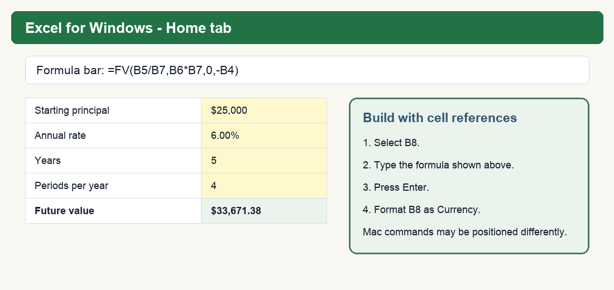

# BUS123 - MATH-M09 - L01 Pre-Reading
## Compound Interest & Future Value

**Course:** Solving Business Problems with Technology - BUS123

**Track:** MATH - Module 09 - Lesson 01

**Case Study Company:** Meridian Advisory Group *(fictional; all data simulated for instruction)*

---

## Connect to Prior Knowledge

Simple interest applies the rate to the original principal only. Compound interest applies the rate to the accumulated balance, so prior interest becomes part of the next period's base.

| | Simple interest | Compound interest |
|---|---|---|
| **Interest earns on** | Original principal only | Principal plus prior interest |
| **Growth pattern** | Linear | Exponential under a fixed positive rate |
| **Manual model** | `FV = P*(1+R*T)` | `FV = PV*(1+i)^n` |
| **Excel approach** | Build the expression | `=FV(rate,nper,0,-pv)` from the investor perspective |

The exponent is the structural difference. With simple interest, time multiplies the rate. With compound interest, the growth factor is raised to a power.

### Numerical evidence: $1,000 at 5%

| Year | Simple interest | Compound interest | Difference |
|---:|---:|---:|---:|
| 1 | $1,050.00 | $1,050.00 | $0.00 |
| 5 | $1,250.00 | $1,276.28 | $26.28 |
| 10 | $1,500.00 | $1,628.89 | $128.89 |
| 30 | $2,500.00 | $4,321.94 | $1,821.94 |

Year 1 looks identical. By year 30, the accumulated base makes the compound result much larger.

> **Training-model boundary:** This lesson assumes a fixed positive rate, regular periodic compounding, and no taxes, fees, inflation, withdrawals, or uncertain market returns. It is not a universal description of every savings account or investment portfolio.

---

## Build the Compound Model

**Excel syntax first:**

`=FV(rate,nper,0,-pv)`

**Manual relationship:**

`FV = PV*(1+i)^n`

| Variable | Meaning | Period rule |
|---|---|---|
| `FV` | Ending balance | Result after all periods |
| `PV` | Starting principal | Today's lump sum |
| `i` or `rate` | Rate per period | Annual rate divided by periods per year |
| `n` or `nper` | Total periods | Years multiplied by periods per year |

> **Critical rule:** `rate` and `nper` must use the same unit of time. If the formula uses a monthly rate, it must also use the total number of months.

### Worked example: Meridian client deposit

A Meridian client invests $40,000 at 4% compounded annually for 3 years.

- Excel: `=FV(4%,3,0,-40000)`
- Manual check: `=40000*(1+4%)^3`
- Future value: **$44,994.56**
- Simple-interest comparison: `=40000*(1+4%*3)` = **$44,800.00**
- Compound advantage: **$194.56**

### Cash-flow signs describe perspective

From the investor's perspective, the $40,000 invested today is an outflow, so it is entered as `-40000`. The future balance is received later and returns as positive. If the perspective is reversed, the signs reverse too. Excel requires opposite signs across cash flows; it does not impose one universal sign on `pv`.

Use a reasonableness check as well as a sign check: in this simplified positive-rate model, the ending balance should be larger than the absolute starting principal.

---

## Match Non-Annual Periods

| Compounding | Rate per period | Total periods |
|---|---|---|
| Annual | `R/1` | `Years*1` |
| Quarterly | `R/4` | `Years*4` |
| Monthly | `R/12` | `Years*12` |
| Daily | `R/365` | `Years*365` |

For $25,000 at a 6% nominal annual rate for 5 years:

| Frequency | Excel formula | Future value |
|---|---|---:|
| Annual | `=FV(6%,5,0,-25000)` | $33,455.64 |
| Quarterly | `=FV(6%/4,5*4,0,-25000)` | $33,671.38 |
| Monthly | `=FV(6%/12,5*12,0,-25000)` | $33,721.25 |
| Daily | `=FV(6%/365,5*365,0,-25000)` | $33,745.64 |

Frequency increases the result when the same nominal annual rate is divided over more compounding periods. Frequency alone does not guarantee that an account with a lower nominal rate will outperform an account with a higher rate.

### Build a labeled quarterly model

| Cell | Label | Enter | Format |
|---|---|---:|---|
| B4 | Starting principal | 25000 | Currency |
| B5 | Annual rate | 6% | Percentage |
| B6 | Years | 5 | Number |
| B7 | Periods per year | 4 | Number |
| B8 | Future value | `=FV(B5/B7,B6*B7,0,-B4)` | Currency |

Expected B8: **$33,671.38**. Change B5 to 7%; B8 should increase to about **$35,369.45**. Restore B5 to 6% afterward.

The starter workbook uses the same habit: cells labeled **INPUT** hold assumptions; cells labeled **FORMULA / RESULT** must contain cell-referenced formulas.

---

## Estimate, Then Verify: Rule of 72

`Years to double approximately = 72 / annual rate (%)`

| Rate | Rule-of-72 estimate |
|---:|---:|
| 4% | 18 years |
| 6% | 12 years |
| 8% | 9 years |

At 7%, the estimate is `72/7` = **10.286 years**. The exact periodic answer is:

`=NPER(7%,0,-1,2)` = **10.245 years**

The estimate is close enough for a quick conversation but not a substitute for an exact model or a guarantee of an investment outcome.

---

## Formula Reference

| Formula | Use | Check |
|---|---|---|
| `=FV(rate,nper,0,-pv)` | Lump-sum future value | Name the cash-flow perspective |
| `=ABS(pv)*(1+rate)^nper` | Manual reconciliation | Must match FV under the same timing |
| `=AnnualRate/PeriodsPerYear` | Rate per period | Adjust whenever frequency changes |
| `=Years*PeriodsPerYear` | Total periods | Must use the same period unit as rate |
| `=72/RatePercent` | Approximate doubling time | Verify with `=NPER(rate,0,-1,2)` |

## Check Your Understanding

Complete these five questions before class.

1. Explain why simple interest is linear while compound interest is exponential.
2. Calculate the future value of $1,000 at 6% compounded annually for 5 years using both `=FV()` and a manual cell-referenced formula.
3. A $25,000 account earns 6% for 5 years with monthly compounding. State the periodic rate and total periods before writing the Excel formula.
4. Use the Rule of 72 to estimate doubling time at 8%, then state how you would verify the estimate exactly in Excel.
5. Account A earns 4% compounded annually; Account B earns 3.8% compounded monthly. Both begin with $100,000 and run for 10 years. Predict which wins and identify the evidence needed to defend the recommendation.

## Key Vocabulary

| Term | Meaning |
|---|---|
| **Compound interest** | Interest calculated on the accumulated balance. |
| **Future value** | The modeled ending balance after a stated rate and number of periods. |
| **Periodic rate** | Annual nominal rate divided by compounding periods per year. |
| **Total periods** | Years multiplied by compounding periods per year. |
| **Cash-flow sign** | Direction of a cash flow from one stated perspective. |
| **Rule of 72** | Approximation for doubling time; verify with an exact model. |

---
