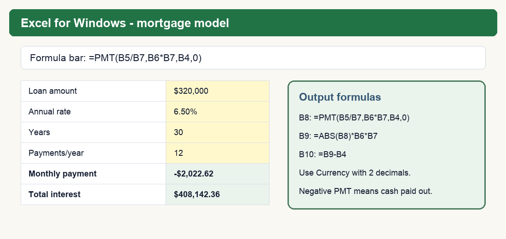
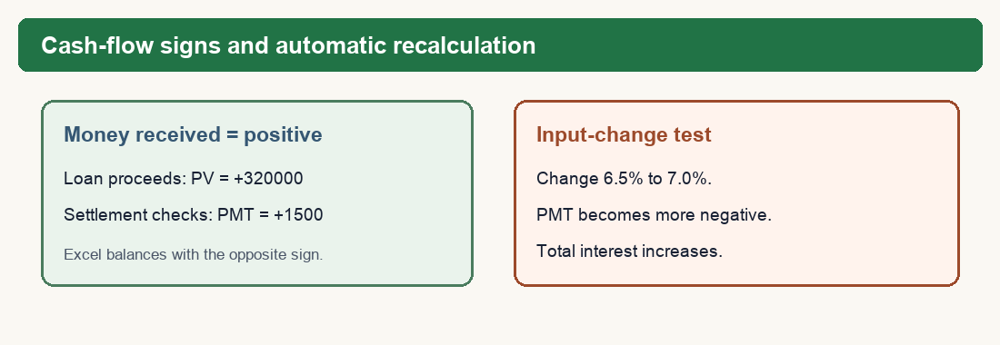

# BUS123 - MATH-M09 - L02 Pre-Reading
## PMT Function & Annuities

**Course:** Solving Business Problems with Technology - BUS123

**Track:** MATH - Module 09 - Lesson 02

**Case Study Company:** Meridian Advisory Group *(fictional; all data simulated for instruction)*

---

## Connect to L01

L01 modeled one lump sum. L02 adds recurring payments: mortgage payments, savings contributions, lease payments, and settlement receipts. The same two habits still govern the model:

1. `rate` and `nper` must use the same time unit.
2. Cash-flow signs must be interpreted from one stated perspective.

An **annuity** is a series of equal payments made at equal time intervals.

| Timing type | When payments occur | Excel `type` | Typical use |
|---|---|---:|---|
| Ordinary annuity | End of each period | 0 or omitted | Most loans and month-end savings plans |
| Annuity due | Beginning of each period | 1 | Beginning-of-period leases or premiums |

An annuity due gives each payment one extra period in the model. Whether that is favorable depends on the problem and the cash-flow perspective.

---

## Choose the Unknown Before the Function

| Business question | Known amount | Unknown | Function family |
|---|---|---|---|
| What equal payment pays off a loan? | Present principal | Periodic payment | `PMT` |
| What equal deposit reaches a target? | Future target | Periodic contribution | `PMT` |
| What will recurring deposits become? | Periodic contribution | Future balance | `FV` |
| What are future receipts worth today? | Periodic receipt | Present value | `PV` |

Do not begin by memorizing a function. First identify what the business decision needs you to solve for.

---

## Model a Loan Payment

**Excel syntax first:**

`=PMT(rate,nper,pv,[fv],[type])`

| Argument | Loan model | Savings-goal model |
|---|---|---|
| `rate` | Annual rate divided by payments per year | Annual rate divided by deposits per year |
| `nper` | Years multiplied by payments per year | Years multiplied by deposits per year |
| `pv` | Financed principal | 0 if no starting balance |
| `fv` | 0 when fully paid off | Positive target balance |
| `type` | 0 for period-end payments unless stated otherwise | Match the deposit timing |

### Meridian mortgage example

A client finances a **$320,000 mortgage principal** at a fixed nominal annual rate of 6.5% for 30 years with monthly payments.

- Monthly rate: `6.5%/12`
- Total payments: `30*12` = 360
- Payment: `=PMT(6.5%/12,30*12,320000,0)` = **-$2,022.62**
- Total paid: `=ABS(PMT result)*360` = **$728,142.36**
- Total interest: `=Total paid-320000` = **$408,142.36**

Keep the unrounded PMT in the formula cell and round only the display. Multiplying the displayed payment by 360 introduces a small rounding difference.

### Cash-flow perspective

From the borrower's perspective, the principal is received now and the payments leave later, so they have opposite signs. In this model, a positive `pv` produces a negative `PMT`. If the signs or viewpoint are reversed, the PMT sign reverses too. PMT is not universally negative.

> **Loan-model boundary:** This training model assumes a fixed nominal rate, monthly compounding, level end-of-month payments, and no prepayment. The $320,000 is financed principal, not necessarily purchase price. Property taxes, insurance, HOA charges, closing costs, points, fees, and changing rates are excluded.

### Build the labeled worksheet model

| Cell | Label | Enter |
|---|---|---:|
| B4 | Financed principal | 320000 |
| B5 | Annual rate | 6.5% |
| B6 | Years | 30 |
| B7 | Payments per year | 12 |
| B8 | Monthly payment | `=PMT(B5/B7,B6*B7,B4,0)` |
| B9 | Total paid | `=ABS(B8)*B6*B7` |
| B10 | Total interest | `=B9-B4` |

### Diagnose the period error

`=PMT(6.5%,30,320000)` = **-$24,504.78**

Excel correctly interprets that as 30 periods at 6.5% per period. It does not know that the intended payment frequency was monthly. The correct monthly model adjusts both inputs:

`=PMT(6.5%/12,30*12,320000,0)` = **-$2,022.62**

---

## Compare Loan Terms

Holding principal and rate constant makes the tradeoff visible:

| Term | Monthly payment | Total interest |
|---:|---:|---:|
| 10 years | $3,633.54 | $116,024.23 |
| 15 years | $2,787.54 | $181,757.84 |
| 20 years | $2,385.83 | $252,600.17 |
| 30 years | $2,022.62 | $408,142.36 |

The 30-year term lowers the monthly obligation by $1,610.92 versus the 10-year term but adds $292,118.13 of interest. Neither term is universally “best.” The recommendation depends on liquidity, risk, opportunity cost, and the client's priorities.

---

## Model Savings and Payment Streams

### Required contribution for a future goal

A Meridian client wants $500,000 in 25 years at 7%, with monthly deposits and no starting balance.

`=PMT(7%/12,25*12,0,500000)` = **-$576.57 per month** from the saver perspective.

### Future value of recurring contributions

A client deposits $500 at each month-end for 30 years at 7%.

`=FV(7%/12,30*12,-500,0)` = **$609,985.50**

Total nominal contributions are $180,000. The difference is modeled compound growth, subject to the fixed-rate training assumptions.

### Present value of received payments

A client will receive $1,500 per month for 10 years. At a 5% annual discount rate:

`=PV(5%/12,10*12,1500,0)` = **-$141,422.03**

The negative result is the modeled amount paid today to receive the positive future stream. For a client who owns the stream, use the absolute value as the economic threshold:

- $130,000 offer: below the modeled value; hold under the stated assumptions.
- $155,000 offer: above the modeled value; consider accepting, subject to fees, taxes, risk, and contract terms.

> A simplified classroom PV comparison is not a universal legal, tax, or financial-advice rule. Real settlement decisions require contract-specific and client-specific review.

---

## Formula Reference

| Formula | Use | Key check |
|---|---|---|
| `=PMT(rate/12,years*12,pv,0)` | Monthly loan payment | State the borrower/lender perspective |
| `=ABS(PMT)*nper` | Total paid | Keep full formula precision |
| `=TotalPaid-PV` | Total interest | Use financed principal, not purchase price |
| `=PMT(rate/12,years*12,0,fv)` | Deposit required for a future goal | Target belongs in `fv` |
| `=FV(rate/12,years*12,-pmt,0)` | Future value of deposits | Match contribution timing |
| `=PV(rate/12,years*12,pmt,0)` | Present value of receipts | Interpret the sign from one perspective |

## Check Your Understanding

Complete these five questions before class.

1. Distinguish an ordinary annuity from an annuity due and give one example of each.
2. Write the cell-referenced PMT, total-paid, and total-interest formulas for a $200,000 principal at 5.5% for 15 years with monthly payments.
3. Explain why `=PMT(6.5%,30,320000)` is a valid Excel calculation but the wrong monthly mortgage model.
4. A client contributes $400 per month at 6% for 25 years. Identify the unknown, the appropriate function family, the periodic rate, and total periods before calculating.
5. A client will receive $2,000 per month for 12 years. Explain how a PV result becomes a decision threshold for a lump-sum offer and name one real-world limitation of the simplified model.

## Key Vocabulary

| Term | Meaning |
|---|---|
| **Annuity** | Equal payments occurring at equal intervals. |
| **Ordinary annuity** | Payments at the end of each period. |
| **Annuity due** | Payments at the beginning of each period. |
| **Financed principal** | Amount actually borrowed, which may differ from purchase price. |
| **PMT** | Excel function that solves for a periodic payment. |
| **Present value** | Today's modeled equivalent of future cash flows. |
| **Cash-flow perspective** | Viewpoint used to label cash received and cash paid. |

---
