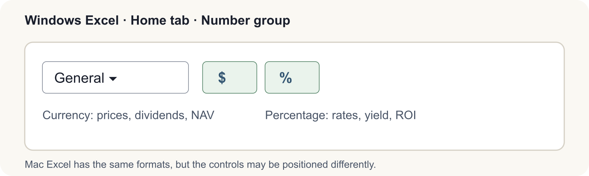
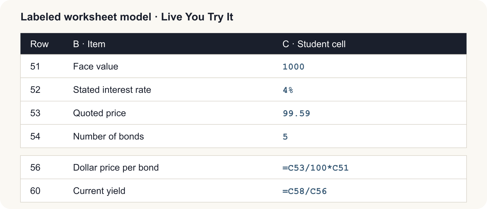
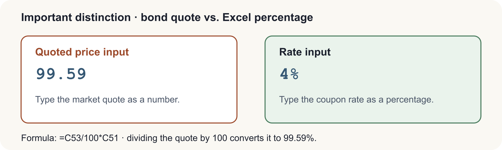
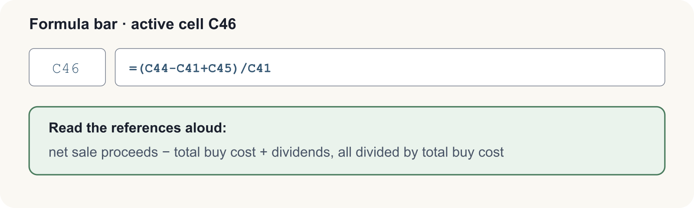

# BUS123 · MATH-M10-L01 Pre-Reading
## Foundations of Investing: Stocks, Bonds, Mutual Funds & ETFs
**Meridian Advisory Group Case Study**
Gerrish School of Business · Endicott College · Fall 2026

---

## Current Events Hook

When a closely watched company prepares to enter the public markets, headlines often focus on its expected valuation and possible offering price. Investors still must ask a question that has no easy answer: *Is this security worth buying at that price?* The names and numbers change; the need to understand ownership, return, risk, and valuation does not.

That question — *how do I decide whether a security is worth owning?* — is exactly what this module is about. By the time you finish MATH-M10, you will be able to read a stock quote, calculate the return on a bond, and determine the net asset value of a mutual fund. Those are the building blocks of every serious investment decision.

---

## Connect to Prior Knowledge

In MATH-M09, you worked with the time value of money — specifically compound interest and present value. You learned that a dollar today is worth more than a dollar in the future because money can earn a return over time.

That exact principle drives everything in this lesson. When you buy a stock, you are paying today for a share of future profits. When you buy a bond, you are lending money today in exchange for interest payments and a return of principal in the future. When you invest in a mutual fund, you are pooling your present-day dollars with others to capture future market growth. The TVM logic does not disappear — it runs underneath every calculation you will do today.

---

## Part 1 · Stocks — Ownership in a Business

### What a Stock Actually Is

A **stock** is a share of ownership in a company. When Meridian Advisory Group recommends that a client buy 200 shares of a company, that client becomes a partial owner of the business — entitled to a share of its profits (paid as dividends) and a claim on its assets if the company is ever liquidated.

Companies issue stock to raise capital. Rather than taking out a bank loan, a business can sell pieces of itself to thousands of investors, using the proceeds to expand, hire, or pay down debt. In return, investors hope the company grows and that their shares become more valuable.

### Common vs. Preferred Stock

There are two main types of stock, and they come with very different rights.

**Common stock** is what most people mean when they say "buying stock." Common shareholders have voting rights — they can vote on major corporate decisions such as who sits on the board of directors. However, they are last in line when dividends are distributed and last in line if the company goes bankrupt.

**Preferred stock** generally does not come with voting rights, but preferred shareholders receive declared dividends before common shareholders, and they have a higher claim than common shareholders on remaining assets if the company fails. With **cumulative preferred stock**, a skipped dividend accumulates as **dividends in arrears**. The arrears normally must be paid before common dividends resume, but they generally are not corporate debt unless the board has formally declared the dividend.

**Key rule:** Preferred shareholders are paid first. Common shareholders receive whatever is left.

### Reading a Stock Quote

Every publicly traded company is identified by a **ticker symbol** — a short code used on exchanges for speed and precision. Coca-Cola is KO. Apple is AAPL. Meridian Advisory Group Holdings, in our case study, uses the symbol MAGH.

When you look up a stock quote, you will see several key data points:

| Term | What It Means |
|---|---|
| **Last Price** | The most recent price at which a buyer and seller completed a trade |
| **Bid Price** | The highest price any buyer is currently willing to pay |
| **Ask Price** | The lowest price any seller is currently willing to accept |
| **Bid-Ask Spread** | Ask minus Bid — the immediate cost of executing a trade |
| **52-Week High / Low** | The highest and lowest traded prices over the past year |
| **P/E Ratio** | Price per share divided by earnings per share — how much investors pay per $1 of earnings |
| **Dividend Yield** | Annual dividend divided by current price — income return expressed as a percentage |

The **bid-ask spread** matters more than most beginners realize. Because you buy at the Ask and sell at the Bid, you are effectively at a small loss the moment a trade is executed. Understanding this gap is one mark of a disciplined investor.

### Calculating Dividends

When a company declares dividends, preferred shareholders collect first. The calculation always follows the same steps:

1. Calculate total preferred dividends: **Rate × Par Value × Number of Preferred Shares**
2. Subtract from total dividends declared to find the **remainder for common shareholders**
3. Divide the remainder by the number of common shares to find the **dividend per common share**

**Worked Example — Meridian Advisory Group**

Meridian's model portfolio company has declared $10,000 in dividends. The capital structure is: 8% preferred stock, $50 par value, 1,000 shares; and 4,000 common shares outstanding.

- Preferred dividend per share: 8% × $50 = **$4.00**
- Total preferred dividend: $4.00 × 1,000 shares = **$4,000**
- Remainder for common: $10,000 − $4,000 = **$6,000**
- Common dividend per share: $6,000 ÷ 4,000 shares = **$1.50 per share**

### Calculating Return on Investment (ROI)

ROI measures how much you made (or lost) on an investment, expressed as a percentage of what you originally put in. It accounts for the price change, commissions, and any dividends received.

**Formula:**

> **ROI = (Net Proceeds − Total Buy Cost + Dividends Received) ÷ Total Buy Cost**

**Worked Example — Meridian Advisory Group**

An analyst at Meridian bought 200 shares of MAGH at $39.09 and sold them one year later at $41.10. The commission rate was 1% on both transactions. MAGH paid a $1.21 annual dividend per share.

| Step | Calculation | Result |
|---|---|---|
| Buy cost (before commission) | 200 × $39.09 | $7,818.00 |
| Buy commission | $7,818 × 1% | $78.18 |
| **Total buy cost** | $7,818 + $78.18 | **$7,896.18** |
| Sale proceeds (before commission) | 200 × $41.10 | $8,220.00 |
| Sell commission | $8,220 × 1% | $82.20 |
| **Net sale proceeds** | $8,220 − $82.20 | **$8,137.80** |
| Total dividends received | 200 × $1.21 | $242.00 |
| **ROI** | ($8,137.80 − $7,896.18 + $242.00) ÷ $7,896.18 | **6.12%** |

---

## Part 2 · Bonds — Lending to a Company

### What a Bond Actually Is

When you own a stock, you own a piece of the company. When you own a bond, you are a **creditor** — you have lent money to the company. The company promises to pay you interest on a schedule and return the full face amount (the **par value**, typically $1,000) at a future date called the **maturity date**.

If a company goes bankrupt, bondholders are creditors and rank ahead of stockholders. Their exact priority depends on the bond's terms and other claims: secured creditors may rank ahead of unsecured bondholders. This creditor status generally makes a particular company's bonds less risky than its stock, though bonds still carry default, interest-rate, inflation, and liquidity risk.

### How Bond Prices Work

Bond prices are always quoted as a **percent of par value**. This is the single most important rule in bond math, and the most common source of errors.

A bond quoted at **99.59** does not cost $99.59. It costs **99.59% of $1,000 = $995.90**.

| Quoted Price | Dollar Price | Status |
|---|---|---|
| Above 100 (e.g., 105.25) | Above $1,000 (e.g., $1,052.50) | **Premium** — bond's rate > market rate |
| Exactly 100 | Exactly $1,000 | **Par** — bond's rate = market rate |
| Below 100 (e.g., 98.00) | Below $1,000 (e.g., $980.00) | **Discount** — bond's rate < market rate |

### Calculating Current Bond Yield

The **current yield** tells you what percentage return you earn annually based on the price you actually paid — not the par value.

**Formula:**

> **Current Yield = Annual Interest ÷ Dollar Price of Bond**

Note that annual interest is always calculated on the **par value**, not the purchase price:

> **Annual Interest = Stated Interest Rate × Par Value ($1,000)**

**Worked Example — Meridian Advisory Group**

Meridian purchased 5 bonds at a quoted price of 99.59. The stated interest rate is 4%.

| Step | Calculation | Result |
|---|---|---|
| Dollar price per bond | 99.59% × $1,000 | $995.90 |
| Total purchase cost (5 bonds) | $995.90 × 5 | $4,979.50 |
| Annual interest per bond | 4% × $1,000 | $40.00 |
| Total annual interest | $40.00 × 5 | $200.00 |
| **Current yield** | $40.00 ÷ $995.90 | **4.02%** |

Notice that the current yield (4.02%) is slightly higher than the stated rate (4%) because the bond was purchased at a slight discount. When you pay less than par, every dollar of interest represents a higher percentage of your actual investment.

---

## Part 3 · Mutual Funds & ETFs — Pooled Investing

### The Case for Diversification

Consider a street vendor who sells both umbrellas and sunglasses. On rainy days, umbrella sales are strong. On sunny days, sunglass sales are strong. By carrying both, the vendor earns consistent revenue regardless of the weather. This is the logic of **diversification** — spreading investments across assets that do not all move in the same direction at the same time.

Research suggests you need at least a dozen carefully selected individual stocks across multiple sectors to be meaningfully diversified. For a beginning investor, building and monitoring that portfolio takes considerable time, skill, and capital. That is where **pooled investment vehicles** come in.

### Mutual Funds vs. ETFs

Both mutual funds and ETFs are "baskets" of investments — one purchase gives you exposure to many underlying securities. Their key differences:

| Feature | Mutual Fund | ETF (Exchange-Traded Fund) |
|---|---|---|
| **Pricing** | Once per day, at market close | Real-time throughout the trading day |
| **Trading** | Priced and traded at end of day only | Trades like a stock — any time during market hours |
| **Minimum Investment** | Often $500–$3,000 minimum | As low as one share |
| **Tax Efficiency** | May distribute capital gains to all holders | More tax-efficient in taxable accounts via "in-kind" exchanges |

One important warning: buying a single-sector ETF (technology only, for example) does not provide true diversification. If the entire tech sector declines, a tech-only ETF declines with it. True diversification requires exposure across multiple sectors — technology, healthcare, energy, financials, consumer goods, and more.

### Net Asset Value (NAV)

Every mutual fund calculates its **Net Asset Value (NAV)** at the end of each trading day. NAV is the dollar value of one share of the fund.

**Formula:**

> **NAV = (Total Market Value of Fund Holdings − Total Liabilities) ÷ Shares Outstanding**

**Worked Example — Meridian Advisory Group Growth & Income Fund**

| Input | Value |
|---|---|
| Market value of fund holdings | $5,550,000 |
| Current liabilities | $770,000 |
| Shares outstanding | 600,000 |

- Net assets: $5,550,000 − $770,000 = **$4,780,000**
- NAV per share: $4,780,000 ÷ 600,000 = **$7.97 per share**

If an investor wanted to purchase 80 shares, they would pay: $7.97 × 80 = **$637.60**.

---

## Formula Reference

| Concept | Formula |
|---|---|
| Bid-Ask Spread | Ask Price − Bid Price |
| Dividend Yield | Annual Dividend ÷ Stock Price |
| Preferred Dividend (total) | Rate × Par Value × Preferred Shares |
| Common Dividend per Share | (Total Dividends − Preferred Dividends) ÷ Common Shares |
| Return on Investment (ROI) | (Net Proceeds − Total Buy Cost + Dividends) ÷ Total Buy Cost |
| Bond Dollar Price | Quoted % × Face Value ($1,000) |
| Bond Current Yield | Annual Interest ÷ Dollar Price |
| Mutual Fund NAV | (Total Assets − Total Liabilities) ÷ Shares Outstanding |

---

<!-- page break -->

## Excel Setup: Inputs First, Outputs Second

Open the starter workbook and select **Live You Try It**. Each practice block uses the same beginner-friendly model:

1. Column **B** names the business item.
2. Yellow cells in column **C** hold either a given input or your formula.
3. Column **D** gives self-check feedback; it is not an answer cell.
4. Column **E** provides a hint.

Use the **Name Box** to confirm the selected cell, then look at the **Formula Bar** to confirm what you typed. These screenshots show Windows Excel. Mac Excel includes the same core tools, but commands may appear in a different position.

### Build the Bond Model in Cells C51:C60

Select **C51** and enter `1000`. Select **C52** and enter `4%`. Select **C53** and enter `99.59` — not `99.59%`. Select **C54** and enter `5`.

Then enter these formulas one cell at a time:

| Select this cell | Type this exact formula | Format | Expected result |
|---|---|---|---|
| **C56** | `=C53/100*C51` | Currency, 2 decimals | **$995.90** |
| **C57** | `=C56*C54` | Currency, 2 decimals | **$4,979.50** |
| **C58** | `=C52*C51` | Currency, 2 decimals | **$40.00** |
| **C59** | `=C58*C54` | Currency, 2 decimals | **$200.00** |
| **C60** | `=C58/C56` | Percentage, 2 decimals | **4.02%** |

**Reasonableness checks:** Because the quote is slightly below 100, the dollar price should be slightly below $1,000. Because the bond sells below par, current yield should be slightly above the 4% stated rate. If C56 shows $99,590 or $9.96, recheck the `/100` conversion.

**Automatic-recalculation test:** Change **C53** from `99.59` to `98`. C56 should change to **$980.00**, C57 to **$4,900.00**, and C60 to about **4.08%**. Undo the change or type `99.59` again before continuing.

### Read an ROI Formula from the Formula Bar

For the ROI practice block, enter the slide givens in **C33:C37**. Build the helper calculations in **C39:C45**. Finally, select **C46** and type `=(C44-C41+C45)/C41`, then apply Percentage with two decimals. The expected ROI is **6.12%**.

Reasonableness check: the selling price is higher than the purchase price and dividends are positive, so ROI should be positive. It should not be enormous because commissions reduce the gain. Change **C37** from `1.21` to `0` as a quick test; ROI should fall to about **3.06%**, proving the result is linked to the dividend input. Restore `1.21` afterward.

Keep **Class Challenge** separate: read each scenario, enter only its stated inputs and your final numeric answer, and use the **FormulaReferenceCard** for syntax reminders. This pre-reading does not provide the graded challenge formulas or completed answers.

---

## Check Your Understanding

Answer these seven questions before class. Bring your work — these may be discussed.

**1.** Meridian recommends a stock currently trading at $52.40 with a bid of $52.33 and an ask of $52.47. What is the bid-ask spread?

**2.** A company has 500 shares of 6% preferred stock with a par value of $100, and 2,000 shares of common stock. Total dividends declared: $8,000. How much does each common shareholder receive per share?

**3.** An analyst at Meridian bought 150 shares at $28.50 and sold them one year later at $31.00. Commission rate: 1% on both sides. No dividend was paid. What is the ROI?

**4.** A bond is quoted at 103.75. What is the dollar price per bond? Is this a premium, discount, or par bond?

**5.** A 5% bond is quoted at 97.50 ($975.00 per bond). What is the current yield?

**6.** Meridian's Balanced Fund has $8,400,000 in holdings, $950,000 in liabilities, and 1,200,000 shares outstanding. What is the NAV per share?

**7.** An investor wants to buy 100 shares of the fund in Question 6. How much will they pay at NAV?

---

### Answer Key

| Q | Answer | Key calculation |
|---|---|---|
| 1 | $0.14 | $52.47 − $52.33 |
| 2 | $2.50/share | Preferred = 6% × $100 × 500 = $3,000; Remainder = $5,000; $5,000 ÷ 2,000 |
| 3 | 7.75% | Buy cost = $4,346.25; Sell proceeds = $4,611.50; ROI = $265.25 ÷ $4,346.25 |
| 4 | $1,037.50; Premium | 103.75% × $1,000 |
| 5 | 5.13% | Annual interest = 5% × $1,000 = $50; $50 ÷ $975.00 |
| 6 | $6.21/share | ($8,400,000 − $950,000) ÷ 1,200,000 |
| 7 | $621.00 | $6.21 × 100 |

---

## Key Vocabulary

| Term | Definition |
|---|---|
| **Stock** | A share of ownership in a company, entitling the holder to a portion of assets and profits |
| **Common Stock** | Stock that provides voting rights; paid dividends after preferred shareholders |
| **Preferred Stock** | Stock without voting rights but with priority on dividends and asset claims |
| **Dividends in Arrears** | Unpaid dividends owed to cumulative preferred shareholders that accumulate over time |
| **Ticker Symbol** | A unique letter code identifying a publicly traded security on an exchange |
| **Bid-Ask Spread** | The difference between the highest buyer price (bid) and lowest seller price (ask) |
| **P/E Ratio** | Price-to-Earnings ratio — stock price divided by earnings per share |
| **Bond** | A debt instrument; the investor lends money to a company in exchange for interest and repayment of principal |
| **Par Value** | The face value of a bond, typically $1,000; the amount repaid at maturity |
| **Current Yield** | Annual bond interest divided by the bond's current dollar price |
| **Net Asset Value (NAV)** | The per-share value of a mutual fund's holdings after subtracting liabilities |
| **Diversification** | Spreading investments across different assets to reduce the impact of any single loss |
| **ETF** | Exchange-Traded Fund — a basket of securities that trades on an exchange like a stock |

---
