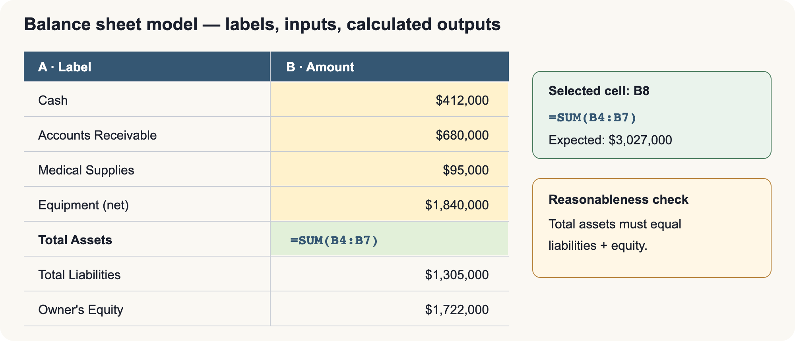
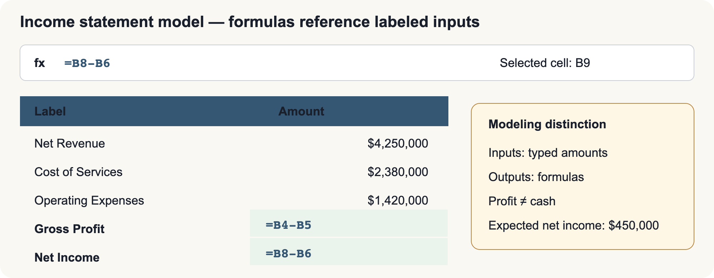
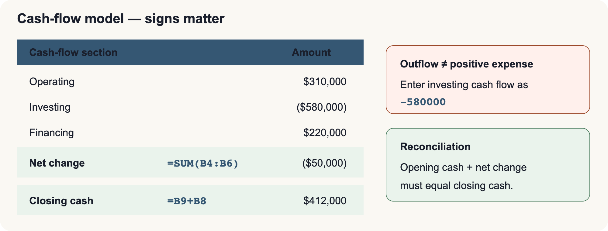
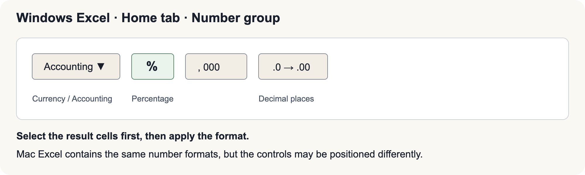

# BUS123 · MATH-M11-L01 · Pre-Reading
## Reading and Analyzing Financial Reports
**Harborside Medical Center · Fall 2026**

---

### Before You Begin

Open `bus123-math-m11-l01-starter.xlsx`. You will use four tabs:

- **START HERE** explains the color key and workflow.
- **Live You Try It** is self-graded practice. Enter inputs in yellow cells and build formulas that reference those cells.
- **Class Challenge** is the graded activity. It begins blank; do not use this reading as an answer key.
- **FormulaReferenceCard** is a syntax reminder after you decide what the business question is asking.

The screenshots in this reading show **Windows Excel**. Mac Excel has the same core commands, but a command may appear in a different position.

---

## Part 1 · The Balance Sheet

### The Accounting Equation

The balance sheet is a snapshot at one date. It reports what a business controls and who has claims on those resources.

**Formula:** `Assets = Liabilities + Owner's Equity`

- **Assets** include cash, accounts receivable, supplies, and equipment.
- **Liabilities** include accounts payable, salaries payable, and loans.
- **Owner's equity** is the residual claim: `Assets − Liabilities`.

If Harborside buys a $400,000 MRI machine with cash, cash decreases and equipment increases by the same amount. Total assets do not change. If Harborside borrows the money, equipment and liabilities both increase by $400,000. In both cases, the equation remains balanced.

> **Harborside check:** Total assets are $3,027,000. Total liabilities are $1,305,000 and owner's equity is $1,722,000. Therefore, $1,305,000 + $1,722,000 = $3,027,000.

### Build a Labeled Excel Model

Put labels in one column, inputs in the next column, and calculated outputs in a separate result area. Do not type numbers directly inside a formula when those numbers already exist in cells.

1. In a blank practice area, type the asset labels in **A4:A7** and their amounts in **B4:B7**: Cash `$412,000`, Accounts Receivable `$680,000`, Medical Supplies `$95,000`, and Equipment (net) `$1,840,000`.
2. Type **Total Assets** in **A8**. Select **B8**, type `=SUM(B4:B7)`, and press Enter. Expected result: **$3,027,000**.
3. Type Total Liabilities `$1,305,000` in **B11** and Owner's Equity `$1,722,000` in **B12**. Select **B13**, type `=SUM(B11:B12)`, and press Enter. Expected result: **$3,027,000**.
4. Select **B4:B13**, then choose **Home > Number > Accounting Number Format** (or Currency). Use zero decimal places.
5. Reasonableness check: **B8 and B13 must match**. If not, check missing lines, signs, and cell references.

**Input-change test:** Change Cash in **B4** from `$412,000` to `$422,000`. B8 should automatically become **$3,037,000**. B13 will remain $3,027,000, revealing a $10,000 imbalance until the financing side is updated. Press Undo when finished.

---

## Part 2 · The Income Statement

The income statement covers a period of time and explains whether operations produced a profit. For this service-business model:

- `Net Revenue − Cost of Services = Gross Profit`
- `Gross Profit − Operating Expenses = Net Income`

Harborside reports net revenue of $4,250,000, cost of services of $2,380,000, and operating expenses of $1,420,000. Gross profit is **$1,870,000** and net income is **$450,000**.

Retail businesses often use `COGS = Beginning Inventory + Net Purchases − Ending Inventory`. That inventory formula is useful context, but Harborside's workbook uses **Cost of Services**, not retail inventory.

1. Type **Net Revenue**, **Cost of Services**, and **Operating Expenses** in **A4:A6**. Enter the three amounts in **B4:B6**.
2. Type **Gross Profit** in **A8**. Select **B8**, type `=B4-B5`, and press Enter. Expected result: **$1,870,000**.
3. Type **Net Income** in **A9**. Select **B9**, type `=B8-B6`, and press Enter. Expected result: **$450,000**.
4. Format **B4:B9** as Accounting or Currency with zero decimals.
5. Reasonableness checks: gross profit should be less than revenue; net income should be less than gross profit when operating expenses are positive.

**Input-change test:** Change Operating Expenses in **B6** to `$1,500,000`. B9 should recalculate to **$370,000**. Press Undo when finished.

---

## Part 3 · The Statement of Cash Flows

Profit and cash are not the same. Under accrual accounting, revenue is recorded when earned and expenses when incurred, even if cash moves later. Accounts receivable can therefore increase profit before cash arrives.

The statement of cash flows groups cash movements into:

| Section | What It Covers | Harborside |
|---|---|---:|
| Operating activities | Day-to-day collections and payments | $310,000 |
| Investing activities | Long-term asset purchases and sales | ($580,000) |
| Financing activities | Borrowing, repayment, and owner transactions | $220,000 |

1. Enter Operating, Investing, and Financing Cash Flow in **A4:A6** and their values in **B4:B6**. Enter the investing outflow as **-580000**, not as a positive number.
2. Select **B8**, type `=SUM(B4:B6)`, and press Enter. Expected net change in cash: **-$50,000**.
3. Enter Opening Cash `$462,000` in **B9**. Select **B10**, type `=B9+B8`, and press Enter. Expected closing cash: **$412,000**.
4. Use Accounting format with zero decimals. Negative cash flows should display with a minus sign or parentheses.
5. Reasonableness check: closing cash must equal opening cash plus the net change, and it should match the balance-sheet cash line for the same date.

**Input-change test:** Change Financing Cash Flow in **B6** from `$220,000` to `$250,000`. Net change should become **-$20,000**, and closing cash should become **$442,000**. Press Undo when finished.

---

## Part 4 · Trend and Ratio Analysis

### Trend Analysis

Trend analysis expresses each year relative to one base year:

**Excel pattern:** `=CurrentYearCell/BaseYearCell`

The base year is 100%. With 2024 net income of $320,000 and 2026 net income of $450,000, `450000/320000 = 140.625%`, displayed as **141%** with zero decimal places. This means 2026 income is 41% above the base-year amount—not that it increased by 141%.

### Ratio Analysis

Ratios standardize financial relationships. Their interpretation depends on the organization, industry, accounting choices, and comparison period; there is no universal “good” ratio.

| Ratio | Excel pattern | What it asks |
|---|---|---|
| Current ratio | `=CurrentAssets/CurrentLiabilities` | Can current assets cover current obligations? |
| Quick ratio | `=(Cash+AccountsReceivable)/CurrentLiabilities` | Can the most liquid assets cover current obligations? |
| Debt to assets | `=TotalLiabilities/TotalAssets` | What share of assets is financed by liabilities? |
| Return on equity | `=NetIncome/OwnerEquity` | How much income was generated per dollar of equity? |
| Profit margin | `=NetIncome/NetRevenue` | How much profit remains per revenue dollar? |
| Asset turnover | `=NetRevenue/TotalAssets` | How efficiently are assets generating revenue? |

For **Live You Try It rows 13–17**, place the stated amounts in the yellow input cells, select the yellow result cell in column **I**, and type a formula using those input-cell references. Use **Percentage** format for trends, profit margin, debt to assets, and ROE. A current or quick ratio is usually shown as a number such as `2.43`, while asset turnover is commonly shown as a number such as `1.40`.

Expected practice results from the slides are:

- 2026 net revenue trend: `$4,250,000 ÷ $3,800,000 = 111.84%` (about **112%**).
- 2026 net income trend: `$450,000 ÷ $320,000 = 140.63%` (about **141%**).
- Profit margin: `$450,000 ÷ $4,250,000 = 10.59%`.
- Debt to assets: `$1,305,000 ÷ $3,027,000 = 43.11%`.
- ROE: `$450,000 ÷ $1,722,000 = 26.13%`.

Reasonableness checks: percentages produced by division should be stored as decimals in Excel; do not multiply by 100 and then also apply Percentage format. Compare ratios with prior years or a relevant peer set before calling them strong or weak.

---

## Use the Workbook Safely

1. Read the scenario and identify the requested output.
2. Enter only the scenario's givens in the yellow input cells.
3. Select the yellow result cell and type a formula beginning with `=` that references the input cells.
4. Apply the unit shown in the workbook: Dollars or Percent.
5. Check the result's direction, size, sign, and units.
6. Change one practice input to confirm automatic recalculation, then undo the test.

In **Class Challenge**, use this process independently. The FormulaReferenceCard reminds you of patterns, but it does not identify the correct cells or provide completed graded answers.

---

## Check Your Understanding

1. Why must both sides of the accounting equation use amounts from the same date?
2. Why can a profitable organization still have a cash shortage?
3. If a trend calculation displays 140.63%, how far above the base year is the current year?
4. Why should formulas reference input cells instead of repeating numbers inside formulas?
5. What comparison would you want before deciding whether a 43.11% debt-to-assets ratio is acceptable?

---

## Key Vocabulary

| Term | Definition |
|---|---|
| Income statement | Revenues, expenses, and profit over a period |
| Accrual basis | Records revenue when earned and expenses when incurred, regardless of cash timing |
| Accounts receivable | Amounts customers or payers owe for services already provided |
| Gross profit | Net revenue minus cost of services or cost of goods sold |
| Statement of cash flows | Cash inflows and outflows grouped as operating, investing, and financing |
| Trend analysis | Expresses each period relative to a chosen base period |
| Ratio analysis | Uses standardized relationships to support comparisons |

---
