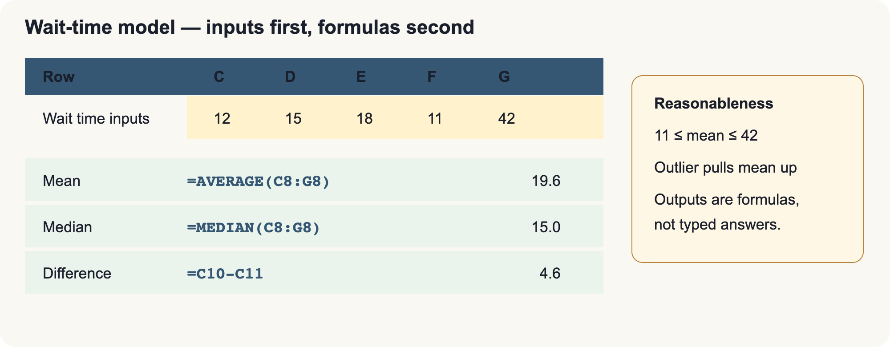
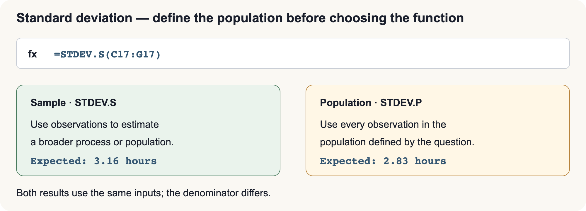
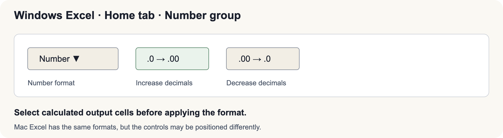
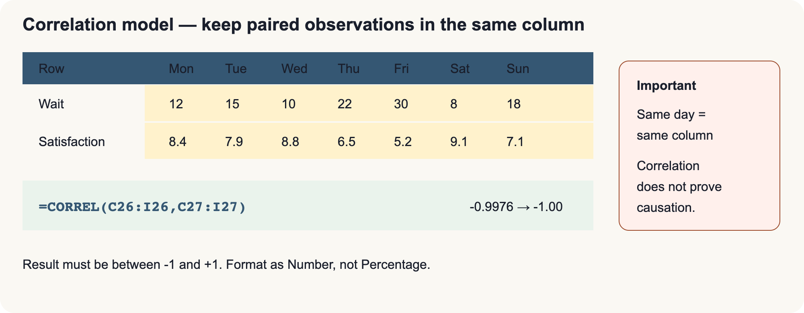

# BUS123 · MATH-M12-L01 · Pre-Reading
## Business Statistics: Center, Spread, and Correlation
**Harborside Medical Center · Fall 2026**

---

## Before You Begin

Open `bus123-math-m12-l01-starter.xlsx`. Its four tabs have different jobs:

- **START HERE** explains the workflow and color key.
- **Live You Try It** is self-graded practice tied to slide examples.
- **Class Challenge** is the graded activity. Its input and answer cells begin blank.
- **FormulaReferenceCard** is a syntax reminder after you decide which statistic answers the question.

The screenshots in this reading show **Windows Excel**. Mac Excel has the same functions and number formats, but commands may appear in different positions.

---

## Part 1 · Organize a Statistical Model

Keep labels, inputs, and calculated outputs separate. Labels explain the data, input cells contain observed values, and output cells contain formulas that reference the inputs.

In **Live You Try It**, the first yellow input row is **C8:G8**. Enter the five wait times from the slides: `12`, `15`, `18`, `11`, and `42`.

1. Select **C10**, type `=AVERAGE(C8:G8)`, and press Enter. Expected result: **19.6 minutes**.
2. Select **C11**, type `=MEDIAN(C8:G8)`, and press Enter. Expected result: **15 minutes**.
3. Select **C12**, type `=C10-C11`, and press Enter. Expected result: **4.6 minutes**.
4. Select **C10:C12**, open **Home > Number**, and use Number format with **1 decimal place**.
5. Reasonableness check: the mean must fall between the minimum (11) and maximum (42). Because 42 is a high outlier, the mean should be above the median.

**Input-change test:** Change the 42 in **G8** to `22`. C10 should recalculate to **15.6**, C11 should remain **15.0**, and C12 should become **0.6**. Press Undo when finished.

### Mean, Median, and Mode

- **Mean:** `=AVERAGE(range)` adds all numeric values and divides by their count. It uses every value, so outliers affect it.
- **Median:** `=MEDIAN(range)` returns the middle value after sorting. It is less sensitive to outliers.
- **Mode:** `=MODE.SNGL(range)` returns one most-frequent **numeric** value. If no numeric value repeats, Excel returns `#N/A`.
- **Multiple numeric modes:** `=MODE.MULT(range)` returns all tied modes. In current Microsoft 365 Excel, the results spill into neighboring cells; older versions may require legacy array entry.

For text categories such as insurance type or diagnosis code, Excel's `MODE.SNGL` does not work. Use a frequency table, PivotTable, or `COUNTIF`-based summary to find the most common text category.

---

## Part 2 · Standard Deviation Measures Spread

Two groups can have the same mean but very different consistency. Standard deviation summarizes how far observations typically spread around the mean, in the same unit as the original data.

- **Sample standard deviation:** `=STDEV.S(range)` estimates spread when the data is a sample from a larger process or population.
- **Population standard deviation:** `=STDEV.P(range)` describes spread when the data contains every observation in the population you have defined.

The choice depends on the business question—not simply whether the dataset is small. A complete month of transactions can be a population if the question is only about that month, but a sample if the goal is to infer future months.

In **Live You Try It**, enter `4`, `6`, `8`, `10`, and `12` in **C17:G17**.

1. Select **C19**, type `=AVERAGE(C17:G17)`, and press Enter. Expected result: **8.00 hours**.
2. Select **C20**, type `=STDEV.S(C17:G17)`, and press Enter. Expected result: **3.16 hours**.
3. Select **C21**, type `=STDEV.P(C17:G17)`, and press Enter. Expected result: **2.83 hours**.
4. Format **C19:C21** as Number with **2 decimal places**.
5. Reasonableness checks: standard deviation cannot be negative; identical values would produce zero; `STDEV.S` is slightly larger than `STDEV.P` for the same non-identical values.

**Input-change test:** Change the 12 in **G17** to `20`. The mean should become **9.60**, sample SD **6.07**, and population SD **5.43**. Press Undo when finished. The larger spread should match what you see in the values.

---

## Part 3 · Correlation Measures a Linear Relationship

Correlation describes the direction and strength of a **linear** relationship between two numeric variables. Pearson's correlation coefficient, `r`, ranges from -1 to +1.

- A positive value means the variables tend to move in the same direction.
- A negative value means they tend to move in opposite directions.
- A value near zero means little linear relationship; a curved relationship may still exist.
- Correlation is undefined if either input range has no variation.

In **Live You Try It**, enter the seven wait times in **C26:I26** and matching satisfaction scores in **C27:I27**. Each column must describe the same day in both rows.

1. Select **C29**.
2. Type `=CORREL(C26:I26,C27:I27)` and press Enter.
3. Format **C29** as Number with **2 decimal places**.
4. Expected result from the lesson data: **-1.00** when displayed to two decimals (unrounded value approximately **-0.9976**).
5. Reasonableness checks: the answer must be between -1 and +1; the two ranges must have the same number of cells; wait and satisfaction values must stay paired by day.

**Input-change test:** Change Friday satisfaction in **G27** from `5.2` to `7.2`. C29 should recalculate to approximately **-0.82**. Press Undo when finished.

### Correlation Does Not Prove Causation

A strong correlation does not prove that changing one variable will cause the other to change. Staffing, case severity, day of week, measurement choices, or another variable could influence both. Treat correlation as evidence for a question to investigate, not as proof of a mechanism.

Fixed “weak/moderate/strong” cutoffs are only rough conventions. Context, sample size, data quality, outliers, and decision risk all matter.

---

## Use the Workbook Safely

1. Read the question and identify the requested statistic.
2. Enter only the stated observations in the yellow input cells.
3. Select the yellow answer cell and type a formula beginning with `=` that references the input range.
4. Apply an appropriate format: minutes or hours as Number; correlation as Number, not Percentage.
5. Check the range, units, sign, and plausible size of the result.
6. Change one practice input to confirm automatic recalculation, then undo the test.

In **Class Challenge**, apply this process independently. Do not copy a completed answer from another source. The FormulaReferenceCard helps with syntax but does not decide which cells or function fit a scenario.

---

## Formula Reference

| Function | Excel syntax | Important check |
|---|---|---|
| AVERAGE | `=AVERAGE(C8:G8)` | Outliers can pull the mean. |
| MEDIAN | `=MEDIAN(C8:G8)` | Uses the middle after sorting conceptually. |
| MODE.SNGL | `=MODE.SNGL(B2:B8)` | Numeric data only; may return `#N/A`. |
| MIN / MAX | `=MIN(B2:B8)` / `=MAX(B2:B8)` | Useful for checking the observed range. |
| STDEV.S | `=STDEV.S(C17:G17)` | Use when estimating a broader process/population. |
| STDEV.P | `=STDEV.P(C17:G17)` | Use for the entire defined population. |
| CORREL | `=CORREL(C26:I26,C27:I27)` | Ranges must be paired and equally sized. |

---

## Check Your Understanding

1. Why is the median lower than the mean for the five wait times?
2. Why can `MODE.SNGL` return `#N/A`?
3. How does the business question determine whether `STDEV.S` or `STDEV.P` is appropriate?
4. What does a negative correlation say about direction?
5. Why is a correlation close to -1 not proof that wait time causes satisfaction to fall?
6. Why should correlation ranges be checked column by column before calculating?

---

## Key Vocabulary

| Term | Definition |
|---|---|
| Mean | Arithmetic average of numeric values |
| Median | Middle value after values are ordered |
| Mode | Most frequently occurring value |
| Outlier | Observation far from most other values |
| Standard deviation | Spread around the mean, expressed in the data's unit |
| Sample | Observations used to learn about a larger process or population |
| Population | The complete set defined by the business question |
| Correlation | Direction and strength of a linear relationship |
| Causation | A change in one variable directly produces a change in another |

---
